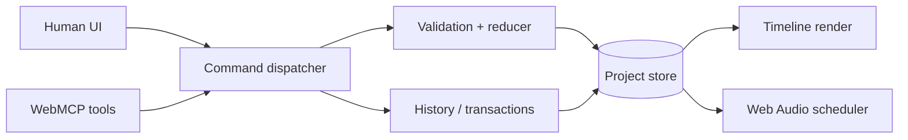

# AgentDAW Project Design

## 1) Goals

### 1.1 Outcomes

1. A visitor can open a browser app, load a demo project, and hear a short
   multitrack arrangement immediately.
2. A human can make the core edits needed for the demo: move, trim, duplicate,
   delete, mute, solo, volume, pan, playback, seek, and BPM changes.
3. An agent can inspect the same project through semantic WebMCP tools instead
   of inferring state from pixels.
4. Human and agent edits pass through one validated command layer.
5. A multi-step agent request appears as one labeled transaction that a human
   can inspect and undo as a unit.
6. The demo proves the sequence human → agent → human → agent.

### 1.2 Non-goals

- A full-featured DAW, notation editor, or production suite.
- Recording, MIDI, piano roll, synthesizers, plugin hosting, VST support,
  time-stretching, pitch correction, mastering, or generative music.
- Multiplayer collaboration, accounts, cloud project storage, or a backend.
- An embedded LLM, prompt orchestration service, or agent chat panel.
- Pixel-perfect waveform editing. Colored clip blocks are sufficient for the
  first demo; waveforms are optional polish.
- A generalized automation language. Commands are the only supported mutation
  interface in the MVP.

### 1.3 Assumptions and constraints

- This is a ten-day solo or very small-team hackathon project.
- The challenge submission deadline is September 3 at 5 p.m. PT; the target is
  feature-complete by September 1, with September 2 for submission materials
  and September 3 for bug fixes.
- The browser is the deployment target and must support Web Audio API and the
  experimental WebMCP surface used by the challenge.
- Audio stays local to the browser in the MVP. No user audio is uploaded to a
  server.
- A demo project and a small set of short audio assets are more important than
  broad file-format support.

## 2) Glossary

| Term | Meaning |
|---|---|
| Agent | An external AI assistant that can call the app's WebMCP tools. |
| Beat | The timeline unit used by the project model; seconds are derived from BPM. |
| Clip | A placed region that references an audio asset and has a start and length. |
| Command | A validated state mutation with a typed payload. |
| Transaction | An ordered group of commands committed as one history entry. |
| Project | BPM, audio assets, tracks, clips, selection, and history metadata. |
| Track | A lane containing clips plus mix controls. |
| WebMCP | The experimental web standard for exposing structured tools to agents. |

## 3) Technical stack

### 3.1 Language and runtime

- TypeScript in a browser-first React application.
- React for the single-screen editor.
- Web Audio API for decoding and playback.
- IndexedDB only if persistence is needed after the first playable demo.

### 3.2 Framework and deployment

- Next.js for the app shell and static deployment path.
- Vercel, Netlify, or another static-friendly host for the live submission.
- No application server in the MVP.

### 3.3 Dependencies

| Category | Choice | Reason |
|---|---|---|
| UI | React + existing project defaults | Fast iteration on a single screen. |
| Audio | Browser Web Audio API | Native playback graph; no audio service to operate. |
| Agent bridge | WebMCP API surface | The challenge requires structured agent access. |
| State | Small typed project store | One source of truth for UI, tools, and history. |
| Persistence | None initially; IndexedDB if required | Avoid backend work before the demo works. |

### 3.4 Target project structure

```text
src/
  app/                 # route and editor shell
  components/          # timeline, transport, inspector, history
  audio/               # Web Audio graph and clip scheduling
  project/             # entities, commands, reducer, history
  webmcp/              # inspection and mutation tool adapters
public/
  demo/                # bundled audio and demo project metadata
docs/
  design.md
```

## 4) Architecture overview

### 4.1 System diagram



### 4.2 Data flow

1. A drag gesture, control change, or WebMCP call creates a typed command.
2. The dispatcher validates entity IDs, numeric ranges, and time boundaries.
3. The reducer applies the command to the project snapshot and returns the
   next snapshot plus an inverse operation where practical.
4. The store publishes the new snapshot to the timeline, inspector, and audio
   scheduler.
5. The history service records the source (`human` or `agent`), label, command
   list, and inverse data. A transaction becomes one undoable entry.

Keeping these stages separate means the UI can change without changing the
agent contract, and WebMCP calls cannot bypass validation or history.

### 4.3 Services and responsibilities

#### Project store

Owns the current immutable project snapshot and dispatches commands. It rejects
invalid commands with a user-readable error and leaves the prior snapshot
untouched. Replaying the same command with a stale entity or invalid range is a
failed operation, not a best-effort mutation.

#### Audio engine

Owns decoded `AudioBuffer` objects, track buses, and scheduled playback. It
consumes project snapshots; it does not mutate project state. If a file cannot
be decoded, the clip remains visible with an error state and playback skips
that clip while the rest of the project remains available.

#### WebMCP adapter

Exposes read tools and semantic mutation tools. It converts tool input into
commands or transactions and returns the resulting project summary. It must
return validation errors with enough context for an agent to correct its call.

#### History service

Groups commands, stores inverse data, and exposes human-readable labels. An
agent transaction is undone as a unit; a later human edit remains intact unless
it is itself selected for undo.

## 5) Project data model

### 5.1 Project

```ts
type Project = {
  id: string;
  name: string;
  bpm: number;                 // 40–240 in the MVP
  durationBeats: number;
  tracks: Track[];
  assets: AudioAsset[];
  selection: Selection | null;
};
```

### 5.2 Track, clip, and asset

```ts
type Track = {
  id: string;
  name: string;
  volumeDb: number;            // practical UI range: -60 to +6
  pan: number;                 // -1 left to +1 right
  muted: boolean;
  soloed: boolean;
  clips: Clip[];
};

type Clip = {
  id: string;
  trackId: string;
  assetId: string;
  startBeat: number;
  sourceOffsetSeconds: number;
  durationSeconds: number;
};

type AudioAsset = {
  id: string;
  name: string;
  source: "demo" | "upload";
  durationSeconds: number;
  blob?: Blob;
};
```

Audio data is local and may be omitted from serialized project metadata. Clip
IDs and asset IDs are stable within a project so both the UI and agent can refer
to the same entities.

## 6) Command model

### 6.1 Command envelope

```ts
type CommandEnvelope = {
  id: string;
  source: "human" | "agent";
  label?: string;
  command: DawCommand;
};
```

The `source` is metadata for history and presentation, not permission to skip
validation. Every command has a deterministic result or a clear rejection.

### 6.2 MVP command union

```ts
type DawCommand =
  | { type: "set_bpm"; bpm: number }
  | { type: "create_track"; trackId: string; name: string }
  | { type: "move_clip"; clipId: string; startBeat: number }
  | { type: "trim_clip"; clipId: string; startBeat: number; endBeat: number }
  | { type: "duplicate_clip"; clipId: string; startBeat: number }
  | { type: "delete_clip"; clipId: string }
  | { type: "set_track_volume"; trackId: string; volumeDb: number }
  | { type: "set_track_pan"; trackId: string; pan: number }
  | { type: "set_track_mute"; trackId: string; muted: boolean }
  | { type: "set_track_solo"; trackId: string; soloed: boolean };
```

Commands operate in beats where arrangement semantics matter. The audio engine
converts beats to seconds using the current BPM. The MVP does not promise
time-stretching: changing BPM changes scheduling, not the pitch or duration of
decoded audio.

### 6.3 Batch transactions

```ts
type EditTransaction = {
  id: string;
  source: "human" | "agent";
  label: string;
  operations: DawCommand[];
};
```

`apply_edits` validates all operations before committing. If any operation is
invalid, the transaction is rejected without applying a partial subset. This is
the key safety boundary for natural-language agent requests.

## 7) WebMCP tool surface

Expose a small semantic surface rather than mirroring every button in the UI.
Names below are the intended contract; the exact registration syntax follows
the WebMCP implementation available in the target browser.

### 7.1 Inspection tools

| Tool | Purpose | Result |
|---|---|---|
| `get_project` | Read BPM, duration, tracks, clips, and selection. | Compact project summary. |
| `get_tracks` | Read track names and mix state. | Track list with IDs. |
| `get_timeline` | Read clips ordered by beat. | Timeline ranges and asset names. |
| `get_selection` | Read the current human selection. | Selection or `null`. |

### 7.2 Editing tools

| Tool | Maps to |
|---|---|
| `create_track` | `create_track` |
| `move_clip` | `move_clip` |
| `trim_clip` | `trim_clip` |
| `duplicate_clip` | `duplicate_clip` |
| `delete_clip` | `delete_clip` |
| `set_track_volume` | `set_track_volume` |
| `set_track_pan` | `set_track_pan` |
| `set_track_mute` | `set_track_mute` |
| `set_track_solo` | `set_track_solo` |
| `set_bpm` | `set_bpm` |

### 7.3 Higher-level tools

| Tool | Purpose |
|---|---|
| `apply_edits` | Validate and commit a labeled list of commands atomically. |
| `duplicate_range` | Copy all clips overlapping a beat range to a destination. |
| `get_history` | Explain recent human and agent changes. |

`duplicate_range` is intentionally a semantic convenience: an agent should be
able to express “repeat the chorus” without individually discovering and
duplicating every clip. It still expands into ordinary commands before commit.

### 7.4 Tool behavior rules

- Read tools are side-effect free.
- Mutation tools return the changed entity summary and history entry ID.
- Unknown IDs, invalid ranges, and out-of-bounds values return structured errors.
- `apply_edits` is all-or-nothing.
- Tool responses should be compact enough for an agent to reuse in its next
  turn; do not return raw audio bytes.

## 8) Agent-aware undo and history

### 8.1 History entry

```ts
type HistoryEntry = {
  id: string;
  source: "human" | "agent";
  label: string;
  commands: DawCommand[];
  inverseCommands: DawCommand[];
  createdAt: number;
};
```

The UI displays entries like:

```text
Agent — Strengthen chorus (5 edits)     [Undo]
  moved synth
  duplicated drums
  bass +2 dB
  ...
```

### 8.2 Undo rules

1. A single human gesture normally creates one entry.
2. An `apply_edits` call always creates one agent entry.
3. Undo applies inverse commands in reverse order.
4. If an inverse cannot be applied because the project was changed outside the
   command system, the UI reports the conflict and keeps the current snapshot.
5. Redo is optional polish; it is not required for the first WebMCP demo.

This makes agent behavior legible without pretending that an agent's work is
irreversible or automatically correct.

## 9) Core workflows

### 9.1 Human edit

1. The user drags a clip.
2. The timeline converts pixels to a beat position.
3. The UI dispatches `move_clip` with `source: "human"`.
4. The dispatcher validates the clip and range.
5. The store updates, history records the inverse, and the audio scheduler
   receives the new snapshot.

### 9.2 Agent inspection and edit

1. The agent calls `get_project` and receives IDs, beats, and track state.
2. The agent chooses one or more semantic operations.
3. For a multi-step request, it calls `apply_edits` with a human-readable label.
4. The adapter validates the complete transaction before committing it.
5. The UI highlights changed clips and adds one grouped history entry.
6. The tool response includes the new state needed for the next agent turn.

### 9.3 Playback

1. The transport starts an `AudioContext` after a user gesture.
2. The scheduler converts clip beats to seconds from the current BPM.
3. Each clip uses an `AudioBufferSourceNode` into its track gain and pan nodes.
4. Track mute/solo state controls routing; project state remains the source of
   truth.
5. Missing or undecodable assets are skipped with a visible warning.

## 10) Security and safety model

- No secrets or API keys are required in the browser-only MVP.
- Uploaded audio stays in memory or IndexedDB and is not sent to a service.
- WebMCP mutation inputs are untrusted and must pass the same validation as UI
  inputs.
- Hard caps prevent pathological calls: 64 tracks, 512 clips, and 100
  operations per transaction in the demo build.
- Tool responses omit raw file contents and return only project metadata.
- The app should clearly label agent-originated changes and provide undo.

## 11) Operational guardrails

### 11.1 Metrics worth observing during the demo

- Time from tool call to visible project update.
- Rejected tool calls by error type.
- Transaction size and transaction failure rate.
- Playback start failures and audio decode failures.
- Browser console errors during the scripted demo.

### 11.2 Health checks

There is no server health endpoint in the MVP. The app's lightweight readiness
check should verify that Web Audio can create an `AudioContext`, the demo
project loads, and WebMCP registration completes. A visible status indicator is
more useful than adding an operational backend for a ten-day demo.

## 12) Persistence and lifecycle

- Demo assets are shipped with the app and versioned with the repository.
- Uploaded blobs last for the current browser session unless IndexedDB is added.
- Project metadata may be exported as JSON later, but export is not required for
  the challenge demo.
- No cloud retention, account deletion, or server-side archival exists in the
  MVP because no server stores user data.

## 13) Deployment

### 13.1 Bootstrap

1. Install the chosen Node.js version and project dependencies.
2. Run the local development server.
3. Test in ChatGPT's in-app browser or Chrome with WebMCP enabled, as described
   by the challenge documentation.
4. Deploy the static app to the selected host.

### 13.2 CI/CD

The first implementation should use the host's default GitHub integration:
pull request → install → typecheck → lint → build; merge to the deployment
branch → production deploy. No custom pipeline or infrastructure-as-code is
needed for the documentation seed.

### 13.3 Rollback

Use the hosting provider's previous deployment rollback. Keep the last known
working demo URL available while polishing the submission.

## 14) Decision log

### Decision: Browser-first, no backend

**Context:** The challenge rewards the human-agent interaction, not account or
storage infrastructure.

**Decision:** Keep audio and project state local to the browser for the MVP.

**Alternatives considered:**

- Add a database and auth — rejected because it consumes the time needed for
  WebMCP and history UX.
- Build a server audio pipeline — rejected because Web Audio is enough for the
  short demo.

**Trade-offs:** Refresh persistence and sharing are deferred.

### Decision: One command layer

**Context:** Separate UI and agent mutation APIs would drift and create unsafe
  edge cases.

**Decision:** Both UI and WebMCP adapters dispatch the same typed commands.

**Alternatives considered:**

- Let WebMCP call store methods directly — rejected because validation and
  history become inconsistent.
- Maintain a separate agent DSL — rejected because it duplicates the model.

**Trade-offs:** The command union must stay intentionally small and stable.

### Decision: Atomic agent transactions

**Context:** Natural-language requests often imply several related edits.

**Decision:** `apply_edits` validates all operations, then commits one history
entry.

**Alternatives considered:**

- Apply calls one at a time — rejected because partial failures are confusing.
- Hide all agent changes — rejected because human review is the product.

**Trade-offs:** Transaction validation is stricter than a best-effort editor.

### Decision: Beats as the semantic timeline unit

**Context:** Agents can reason about musical structure more easily in bars and
beats than in pixels or raw seconds.

**Decision:** Store arrangement positions in beats and derive seconds from BPM.

**Alternatives considered:**

- Store only seconds — rejected because the agent-facing contract is less
  musical and harder to demo.
- Implement full tempo mapping — rejected as outside the MVP.

**Trade-offs:** BPM changes do not provide time-stretching.

## 15) Implementation checklist

### Foundation

- [ ] Create the typed project, track, clip, asset, command, and history models.
- [ ] Implement a reducer/dispatcher with validation and inverse commands.
- [ ] Add grouped transactions and atomic failure behavior.

### Audio

- [ ] Load the bundled demo assets.
- [ ] Support local upload and decode.
- [ ] Build track gain/pan/mute/solo routing.
- [ ] Implement play, pause, seek, and BPM-derived scheduling.

### Timeline

- [ ] Render track lanes, clip blocks, beat grid, playhead, and selection.
- [ ] Add drag, trim, duplicate, delete, and basic zoom.
- [ ] Add transport and track controls.

### WebMCP

- [ ] Register the four inspection tools.
- [ ] Register the ten direct editing tools.
- [ ] Register `apply_edits`, `duplicate_range`, and `get_history`.
- [ ] Return structured validation errors and compact summaries.

### Human-agent UX

- [ ] Show agent-originated changes in the timeline.
- [ ] Display grouped history entries and one-click undo.
- [ ] Script the human → agent → human → agent demo.

### Submission

- [ ] Deploy a stable live URL.
- [ ] Record the demo video.
- [ ] Write the project description around the collaboration loop.
- [ ] Freeze features by September 1; reserve September 2–3 for submission and
  bug fixes.

## 16) Development plan: Aug 25–Sep 3

| Date | Focus | Exit criterion |
|---|---|---|
| Aug 25 | Foundation | Models, dispatcher, reducer, undo skeleton. |
| Aug 26 | Audio | Demo stems upload/decode/play with volume and pan. |
| Aug 27 | Timeline | Lanes, clips, drag, selection, playhead. |
| Aug 28 | Editing | Move, trim, duplicate, delete, mute, solo through commands. |
| Aug 29 | WebMCP | Inspection and direct mutation tools work in ChatGPT/Chrome. |
| Aug 30 | Agent operations | Atomic `apply_edits`, `duplicate_range`, fade polish if time remains. |
| Aug 31 | Human-agent UX | History grouping, undo, highlights; use office hours at 11 a.m. PT. |
| Sep 1 | Polish | Demo project, shortcuts, empty states, responsive cleanup. |
| Sep 2 | Submission | Deploy, record, write submission copy, verify repository. |
| Sep 3 | Buffer | Bug fixes only before 5 p.m. PT. |

The cutoff is deliberate: if a feature is not serving the collaboration demo,
it waits until after submission.

## 17) Summary

- AgentDAW is a browser-first multitrack editor for human-agent collaboration.
- The timeline is visual for humans and semantic for agents.
- WebMCP exposes project inspection and editing tools.
- UI and agent paths share one command dispatcher and reducer.
- Agent transactions are atomic, labeled, visible, and undoable.
- The audio engine uses native Web Audio nodes.
- Audio and project state stay local in the MVP.
- The demo centers on handoffs, not autonomous music generation.
- A small stable tool surface beats dozens of low-level controls.
- Scope is frozen around a ten-day challenge submission.
