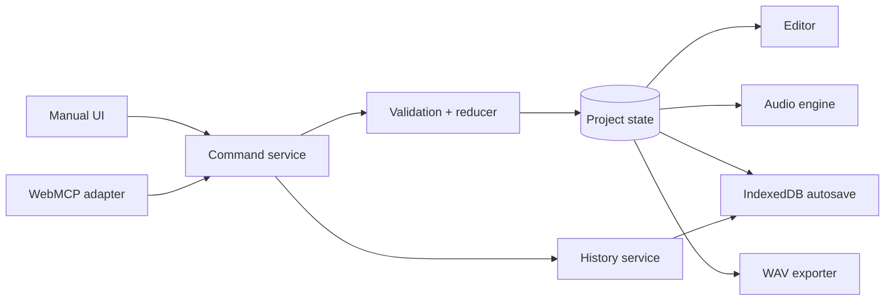

# AgentDAW Project Design

## 1) Goals

### 1.1 Outcomes

1. A beginner can start a blank desktop-browser project and create an instrumental song without importing audio.
2. A user can program arrangement-owned reusable drum and melodic patterns, mix the tracks, play the result, and export WAV.
3. An external agent can inspect and edit the same project through WebMCP, from full-song composition down to exact notes and drum hits.
4. Manual and agent edits pass through one command service after input-boundary validation and are attributed in chronological history.
5. The user can undo, redo, or restore an earlier version without erasing history.
6. The complete workflow is stable by September 1, leaving September 2–3 for submission and fixes.

### 1.2 Product definition

AgentDAW is a desktop browser-based **pattern workstation** for beginner and music-curious creators. The user can compose with clicks or ask an external WebMCP agent to compose. Both paths edit the same instruments, patterns, arrangement, mixer, and history.

```text
create pattern → arrange song → play and mix → revise manually or by agent → export WAV
```

The MVP succeeds when a user or agent can start empty, create drum, bass, chord, and melody parts, arrange a complete instrumental, and export the audible result. There is no artistic song-length target; technical caps only prevent browser resource exhaustion.

### 1.3 MVP scope

- Blank and bundled demo projects.
- Drum tracks using a bundled kit with stable sound identifiers.
- Synth tracks using one polyphonic Web Audio engine with curated bass, chord, lead, and pad presets.
- Reusable 1-, 2-, or 4-bar patterns in 4/4 with sixteenth-note quantization; every pattern has at least one arrangement clip.
- Drum step grid with named sound rows.
- Melodic piano roll with pitch, note start, note length, and chords.
- Arrangement clips that reference patterns and can be placed, repeated, moved, duplicated, shortened, and deleted on a bar grid.
- Playback, seek, BPM, track names, preset selection, track volume, pan, mute, solo, and master volume.
- Browser-local autosave and full-arrangement WAV export.
- Chronological manual and agent history with undo, redo, and non-destructive restore.
- Direct WebMCP tools plus atomic multi-operation transactions.
- Desktop layout with beginner-friendly labels and defaults.

### 1.4 Stretch scope

Stretch work starts only after every MVP acceptance path passes:

- Per-note velocity; additional instruments, drum kits, and presets.
- Downloadable project-file import/export.
- User audio import and clip editing.
- Synth sound design.
- Effects, automation, EQ, compression, sends, and mastering.
- Tablet or phone layouts.

### 1.5 Non-goals

- Microphone or instrument recording.
- Embedded chat, model calls, or prompt orchestration.
- Accounts, backend storage, cloud sync, or multiplayer.
- Arbitrary audio decoding, waveform editing, fades, crossfades, or time-stretching.
- MIDI hardware, MIDI files, notation, odd meters, triplets, swing, or free-time notes.
- VST, Audio Unit, or third-party plugin hosting.
- Production mastering or replacement of a professional DAW.
- Git-style branches or selective removal of an arbitrary past action while preserving later actions.

### 1.6 Assumptions and constraints

- Development starts August 25 with a September 3 submission deadline.
- This is a solo or very small-team challenge build.
- The target is a current desktop browser with Web Audio, IndexedDB, `OfflineAudioContext`, and challenge-supported WebMCP.
- The host page is static; no application server or secrets are required.
- WebMCP may require the challenge's supported browser or feature setup.
- Sound uses bundled drum samples and deterministic synth presets.
- Audio must be pleasant enough for a demo, not mastering-grade.

## 2) Glossary

| Term | Meaning |
|---|---|
| Agent | External AI assistant operating AgentDAW through WebMCP. |
| Arrangement | Song-level sequence of pattern clips across tracks. |
| Arrangement clip | Reference to a reusable pattern placed at a bar and repeated. |
| Command | Validated project mutation from the UI or WebMCP. |
| Compensating edit | New action reversing part of an earlier action without rewriting history. |
| Drum hit | Trigger for a named drum sound on one sixteenth-note step. |
| Pattern | Reusable 1-, 2-, or 4-bar collection of drum hits or synth notes, always placed by at least one arrangement clip. |
| Piano roll | Grid whose horizontal axis is time and vertical axis is pitch. |
| Preset | Curated fixed configuration of the built-in synth. |
| Restore | Replace current state with an earlier snapshot and record it as a new action. |
| Step | One sixteenth note; 16 steps make one 4/4 bar. |
| Transaction | Ordered commands validated and committed as one history entry. |
| WebMCP | Browser surface through which an external agent discovers and calls tools. |

## 3) Technical stack

### 3.1 Runtime and deployment

- Strict TypeScript, React, and Next.js.
- Native Web Audio for drums, synthesis, mixing, and offline rendering.
- IndexedDB for project and history persistence.
- Static-friendly deployment on Vercel or an equivalent host.
- No application server, database server, authentication provider, or secrets.

### 3.2 Dependencies

| Category | Choice | Purpose |
|---|---|---|
| Application | Next.js + React | Editor shell and static deployment path. |
| Language | TypeScript | Shared strict types across all boundaries. |
| Audio | Web Audio API | Native scheduling, synthesis, mixing, and render. |
| Persistence | IndexedDB | Native structured storage without a backend. |
| IDs | `crypto.randomUUID()` | Stable identifiers without a package. |
| State | React reducer and context | One store without another state library. |
| Agent bridge | WebMCP browser API | External-agent inspection and mutation. |

### 3.3 Target structure

```text
src/
  app/                 # route, start screen, editor shell
  components/          # transport, arranger, sequencers, mixer, history
  audio/               # scheduler, sampler, synth, offline renderer
  project/             # entities, commands, reducer, history
  persistence/         # IndexedDB load and save
  webmcp/              # tool schemas, registration, adapters
public/demo/           # demo project and bundled drum samples
docs/design.md
```

## 4) Architecture overview



### 4.1 Mutation flow

A completed manual gesture or WebMCP call produces a typed command. Input adapters own validation of identifiers, musical ranges, relationships, and caps. The internal command service and reducer trust that data and create the next immutable state without repeating checks. Both paths share attribution and history. Input adapters are planned, not yet implemented.

### 4.2 Playback flow

The audio engine consumes state but never mutates it. On play or seek, it converts arrangement bars and pattern steps to seconds using BPM, then schedules drum samples or synth voices through per-track gain and pan nodes. Project changes invalidate future scheduling and reschedule safely from the current transport position.

### 4.3 Persistence and export flow

Committed project and history state saves asynchronously to IndexedDB. WAV export renders a frozen project through an offline graph and encodes PCM as a downloadable WAV. A save or export failure cannot corrupt current project state.

## 5) WebMCP integration

AgentDAW registers semantic tools with the WebMCP API in the challenge-supported browser. The integration requires no OAuth, key, webhook, or server. Inputs are untrusted and must be validated at the WebMCP boundary before reaching the trusted project package.

The UI displays registration status so unsupported browser setup is distinguishable from a project error. Exact registration syntax follows the challenge-supported WebMCP version during implementation; the contracts in Section 10 remain stable.

## 6) Components

### 6.1 Project store and command service

**Responsibility:** Own current immutable state and provide the only mutation path.

**Inputs:** Manual commands, agent commands and transactions, undo, redo, and restore.

**Outputs:** Project state, history entry, UI/audio update, and autosave request.

| Failure | Behavior | Recovery |
|---|---|---|
| Invalid external command or batch | Input adapter rejects before dispatch. | Return an actionable field error from the adapter. |
| Internal execution error | Propagate the exception without committing project or history. | Fix the caller or failing dependency. |
| Duplicate command ID | Return the prior result. | Continue from current state. |

Commits are synchronous and deterministic. Duplicate IDs are idempotent; JavaScript serialization prevents concurrent reducer writes.

### 6.2 History service

**Responsibility:** Record attributed actions and restorable state, coalescing a gesture or batch into one entry.

**Inputs:** Successful commits and history-control requests.

**Outputs:** Activity entries, history cursor, and restored state.

| Failure | Behavior | Recovery |
|---|---|---|
| Snapshot cap reached | Prune oldest restorable entries. | Keep current and recent state. |
| Restore during playback | Stop playback first. | Rebuild scheduling from restored state. |
| New edit after undo | Discard redo states. | Continue from the new branch. |

One completed gesture or agent transaction maps to one entry. History mutations are atomic.

### 6.3 Audio engine

**Responsibility:** Load drum samples, create preset synth voices, schedule notes, and route tracks through the mixer.

**Inputs:** Project snapshot and transport controls.

**Outputs:** Stereo audio and transport timing.

| Failure | Behavior | Recovery |
|---|---|---|
| Audio context blocked | Keep editing available. | Resume after user gesture. |
| Sample missing | Skip hit and identify sound. | Other voices continue. |
| Voice cap reached | Stop oldest voice on the track. | Continue later notes. |
| State restored | Cancel future sources. | Rebuild and wait for Play. |

Scheduling uses a short look-ahead window and never duplicates an already scheduled event.

### 6.4 WebMCP adapter

**Responsibility:** Register tools, map mutation inputs to commands, and return compact structured results.

**Inputs:** Tool calls and current project/catalog state.

**Outputs:** Read summaries, history entry IDs, changed entities, or errors.

| Failure | Behavior | Recovery |
|---|---|---|
| WebMCP unavailable | Manual editing remains functional. | Show setup status. |
| Unknown entity/sound | Reject with invalid ID. | Re-inspect and retry. |
| Oversized batch | Reject before mutation. | Divide into smaller batches. |

Reads are side-effect free; mutations are idempotent by call ID; batches are atomic.

### 6.5 Persistence service

**Responsibility:** Load the latest local project and asynchronously save committed project/history state.

**Inputs:** Successful commits and project lifecycle actions.

**Outputs:** Versioned IndexedDB record and save status.

| Failure | Behavior | Recovery |
|---|---|---|
| Storage unavailable | Continue in memory with warning. | Avoid refresh. |
| Quota exceeded | Preserve in-memory state. | Prune history and retry once. |
| Unsupported schema | Preserve stored record. | Offer blank or demo project. |

Saves are debounced and ordered. Multiple tabs editing one project are unsupported.

### 6.6 WAV exporter

**Responsibility:** Render the complete arrangement offline and encode stereo WAV.

**Inputs:** Frozen project and bundled samples.

**Outputs:** WAV download or visible export error.

| Failure | Behavior | Recovery |
|---|---|---|
| Duration exceeds cap | Reject before allocation. | Shorten song or raise BPM. |
| Offline render fails | Leave project unchanged. | Report stage and retry. |
| Sample missing | Reject with sound ID. | Reload assets. |

Export is deterministic for a project and sample set and never creates history.

## 7) Data model

All IDs are UUID strings. Ordering is explicit so UI and agent results stay stable.

### 7.1 Project

| Field | Type | Constraint |
|---|---|---|
| `schemaVersion` | integer | Current supported version. |
| `id` | UUID | Stable identifier. |
| `name` | string | 1–80 characters. |
| `bpm` | number | 40–240. |
| `masterVolumeDb` | number | -60 to 0 dB. |
| `tracks` | Track[] | Ordered; maximum 16. |
| `patterns` | Pattern[] | Maximum 128; every pattern has at least one arrangement clip. |
| `arrangement` | ArrangementClip[] | Maximum 512. |

### 7.2 Track

| Field | Type | Constraint |
|---|---|---|
| `id` | UUID | Stable identifier. |
| `name` | string | 1–40 characters. |
| `kind` | `drum` or `synth` | Immutable after creation. |
| `instrumentId` | string | Existing kit or preset. |
| `volumeDb` | number | -60 to +6 dB. |
| `pan` | number | -1 to +1. |
| `muted`, `soloed` | boolean | Mixer state. |

### 7.3 Pattern content

| Entity | Fields | Constraint |
|---|---|---|
| Pattern | `id`, `trackId`, `name`, `lengthBars`, `content` | 1, 2, or 4 bars; maximum 512 events. |
| Drum hit | `id`, `soundId`, `startStep` | Sound belongs to kit; step is in range. |
| Synth note | `id`, `midiNote`, `startStep`, `lengthSteps` | MIDI 24–96; positive in-range length. |

Drum patterns contain only hits and synth patterns only synth notes. Overlapping synth notes allow chords.

### 7.4 Arrangement clip

| Field | Type | Constraint |
|---|---|---|
| `id` | UUID | Stable identifier. |
| `patternId` | UUID | Existing pattern. |
| `startBar` | integer | Zero or greater. |
| `repeatCount` | integer | 1–64. |

Different tracks may overlap. Clips on the same track may not overlap because simultaneous patterns on one instrument are ambiguous for the target user.

### 7.5 History entry

| Field | Type | Constraint |
|---|---|---|
| `id` | UUID | Stable activity identifier. |
| `source` | `manual` or `agent` | UI or WebMCP dispatch-path attribution. |
| `label` | string | User-readable summary. |
| `createdAt` | integer | Unix milliseconds. |
| `operations` | Operation[] | Ordered committed commands. |
| `before`, `after` | Project snapshots | Restorable states. |

Attribution identifies the application control path, not cryptographic identity.

## 8) Storage artifacts

IndexedDB stores one versioned record per local project containing project state, retained history, and update time. Bundled samples stay as deployment assets. Runtime audio nodes, decoded buffers, playback position, hover state, and open panels are not persisted.

The MVP opens the most recently edited project. Downloadable project files are stretch scope.

## 9) Core workflows

### 9.1 Manual composition

1. Start blank or load the demo.
2. Create a drum or synth track and select a preset.
3. Create a 1-, 2-, or 4-bar pattern directly in the arranger with its first clip; duplicate patterns the same way.
4. Toggle drum hits or add, move, resize, and delete synth notes.
5. Repeat shared patterns in the arranger, or make one clip unique before changing its pattern.
6. Removing a pattern's last clip removes that pattern; shared patterns remain while another clip still places them.
7. Commit each completed gesture as one manual history entry.
8. Reschedule playback from updated state.

Invalid gestures snap back and explain why. Pointer movement commits only on release so history stays readable.

### 9.2 Agent composition

1. Agent calls `get_sound_catalog` and `get_project`.
2. Agent translates broad or granular instructions into semantic calls.
3. For a song or section, it submits one `apply_operations` batch.
4. Validate each operation against temporary state in order.
5. Commit the full batch once or commit nothing.
6. Highlight affected entities and display one agent history entry.

Identical operation payloads are deterministic. Musical generation belongs to the external agent and is not deterministic inside AgentDAW.

### 9.3 Compensating edit

1. User asks the agent to reverse a specific part of an earlier batch.
2. Agent compares `get_history` with current project state.
3. Agent submits new operations restoring intended values while retaining unrelated changes.
4. Record the correction as a new agent entry.

Compensation can fail when later edits removed a dependency. The conflict is returned and history is never rewritten.

### 9.4 Undo, redo, and restore

1. Undo replaces current state with the latest entry's `before` snapshot.
2. Redo applies the corresponding `after` snapshot.
3. A new edit after undo discards redo states.
4. A user-triggered restore copies a retained snapshot into a new `manual` action.
5. Playback stops and audio scheduling rebuilds.

### 9.5 Playback and export

Playback converts bars and steps to seconds with `60 / BPM`, expands pattern repetitions inside a short look-ahead window, triggers drum samples or synth voices, and applies the mixer. Pause or seek cancels scheduled sources before restarting.

WAV export freezes state, validates duration and samples, renders the full mixer offline, and encodes a 44.1 kHz 16-bit stereo WAV. It is read-only and creates no history entry.

### 9.6 Limits

| Parameter | Default |
|---|---:|
| BPM | 40–240 |
| Tracks | 16 |
| Patterns | 128 |
| Events per pattern | 512 |
| Arrangement clips | 512 |
| Arrangement end | 256 bars |
| Operations per batch | 100 |
| Retained history entries | 100 |
| Live synth voices | 64 |
| WAV duration | 10 minutes |

## 10) WebMCP contracts

Every mutation accepts a call ID for idempotency and returns a history entry ID plus changed-entity summaries. Errors name the failing field or batch index and leave state unchanged.

### 10.1 Inspection

| Tool | Result |
|---|---|
| `get_project` | Compact tracks, patterns, notes, arrangement, mix, and optional filtered detail. |
| `get_sound_catalog` | Stable drum sound and synth preset IDs with descriptions. |
| `get_history` | Retained source, label, operations, and relevant prior/current values. |

### 10.2 Direct mutation

| Family | Tools |
|---|---|
| Project | `set_project_details` |
| Tracks | `create_track`, `update_track`, `delete_track` |
| Patterns | `create_pattern`, `duplicate_pattern` (both require a placement), `update_pattern`, `delete_pattern` |
| Notes | `add_notes`, `update_notes`, `delete_notes` |
| Arrangement | `place_pattern`, `update_arrangement_clip`, `delete_arrangement_clip` |

Deleting a pattern requires `delete_clips` when it has dependent clips. Removing a pattern's last clip removes the pattern; shared patterns remain while another clip still places them. Direct calls create one agent history entry each.

### 10.3 Batch mutation

`apply_operations` accepts a label and ordered list of the same direct operations. Its API adapter must validate the whole batch against successive temporary states, including operation types, references, dependencies, and the 100-operation limit. The internal command service applies the trusted operations in order and commits one agent entry without revalidating them.

## 11) Security and privacy

- No API keys or secrets.
- Project data remains in-browser unless WAV is exported.
- WebMCP inputs receive strict schema and domain validation at the API boundary, not in the internal project package.
- Text renders as text, never interpreted HTML.
- Input adapters validate IDs and numeric ranges before dispatch, scheduling, or allocation.
- Input adapters enforce product caps; the project service only enforces history and command-cache retention.
- Tool results contain metadata, never raw audio.
- Agent changes are visible and reversible.
- No authentication because there is no server or shared data.

## 12) Operational guardrails

The editor reports audio-context availability, bundled-asset load, and WebMCP registration. WebMCP failure does not disable manual editing; audio failure does not hide or corrupt the project.

Useful local diagnostics are rejected commands by validation code, audio underruns or voice-cap events, IndexedDB failures, WAV render duration/failures, and WebMCP registration/tool failures. No remote analytics service is required for the challenge.

## 13) Retention and lifecycle

- Latest project and up to 100 complete history entries persist until site data is cleared or the project is replaced.
- Autosave is local and does not synchronize across devices.
- Under storage pressure, oldest history is removed before current state.
- Bundled samples follow deployment retention; WAV files are browser downloads.
- Multi-tab editing of the same project is unsupported.

## 14) Deployment and schedule

Pull requests run installation, unit tests, typecheck, lint, and production build. Merge triggers static deployment. No infrastructure-as-code is justified because no custom infrastructure exists. Rollback uses the hosting provider's prior deployment.

| Date | Required outcome |
|---|---|
| Aug 25 | Approved design and implementation plan. |
| Aug 26 | Project model, commands, history, undo, redo. |
| Aug 27 | Drum sampler, synth presets, playback. |
| Aug 28 | Drum grid and piano roll. |
| Aug 29 | Pattern arrangement and mixer. |
| Aug 30 | WebMCP inspection and direct tools. |
| Aug 31 | Atomic batches and agent-readable history. |
| Sep 1 | Autosave, WAV export, demo, feature freeze. |
| Sep 2 | Integration fixes, deploy, recording, submission copy. |
| Sep 3 | Submission buffer only. |

## 15) Decision log

### Decision: Step sequencing over audio clips

**Decision:** Build songs from drum hits and synth notes on a beat grid.

**Alternatives:** Loops and recording require audio decoding, waveforms, offsets, and tempo matching.

**Trade-off:** No recording or arbitrary audio import in the MVP.

### Decision: Pattern workstation

**Decision:** Separate a selected-pattern editor from song arrangement.

**Alternatives:** Scene launch adds performance concepts; one long piano roll makes reuse cumbersome.

**Trade-off:** Onboarding must clearly distinguish patterns from arrangement clips.

### Decision: External WebMCP agent

**Decision:** External ChatGPT or another compatible agent supplies musical reasoning.

**Alternatives:** Embedded chat duplicates the challenge host and requires credentials and infrastructure.

**Trade-off:** Agent use needs a supported environment; manual creation remains independent.

### Decision: Direct tools plus batches

**Decision:** Expose discoverable entity tools and `apply_operations` for grouped composition.

**Alternatives:** One generic tool is hard to discover; direct calls alone leave partial songs and noisy history.

**Trade-off:** The public surface and batch operation union duplicate schemas.

### Decision: Snapshot history

**Decision:** Retain before/after snapshots for 100 actions in IndexedDB.

**Alternatives:** Event replay and branches add migration and conflict complexity.

**Trade-off:** Restore depth is bounded, but pattern projects are small.

### Decision: Preset-only instruments

**Decision:** One drum kit and one poly synth engine with curated presets.

**Alternatives:** Sound design and multiple engines expand audio and UI testing.

**Trade-off:** Sonic variety is curated rather than open-ended.

## 16) Verification strategy

### 16.1 Automated checks

- Input-adapter range, identifier, ownership, overlap, and dependency validation when those adapters are implemented.
- Pattern and note editing.
- Batch success and rollback at every failing position.
- Attribution, history labels, undo, redo, restore, and redo invalidation.
- Deterministic bar/step/BPM scheduling times.
- Equivalent manual and WebMCP commands produce identical state.
- IndexedDB save/reload and WAV headers/duration.

### 16.2 Acceptance paths

1. Blank → tracks → patterns → arrangement → mix → reload → WAV.
2. Demo → manual note edit → undo → redo → restore.
3. Agent inspects → creates song in one batch → user edits → agent applies granular correction.
4. Invalid agent batch → structured error → no partial mutation.

## 17) Implementation checklist

### Foundation

- [ ] Bootstrap strict TypeScript and minimal tests.
- [ ] Implement entities, caps, reducer, and command service with trusted typed inputs.
- [ ] Implement history grouping, undo, redo, and restore.

### Audio and UI

- [ ] Add licensed drum samples and catalog.
- [ ] Implement sampler, preset poly synth, mixer, transport, and voice caps.
- [ ] Implement start screen, track controls, drum grid, piano roll, arranger, and history UI.

### WebMCP, persistence, and export

- [ ] Register inspection and direct mutation tools.
- [ ] Implement atomic `apply_operations` and structured errors.
- [ ] Implement schema-versioned IndexedDB autosave/load.
- [ ] Implement offline render and WAV encoding.

### Submission

- [ ] Build demo song and scripted collaboration sequence.
- [ ] Run automated and acceptance checks.
- [ ] Deploy, retain rollback, record demo, and prepare submission.
- [ ] Freeze features September 1.

## 18) Summary

- Beginner-oriented desktop pattern workstation.
- Manual clicks and external WebMCP composition share one project.
- Reusable drum and synth patterns feed a bar-aligned arrangement.
- One preset synth covers bass, chords, leads, and pads.
- Basic mixer, autosave, and WAV export complete the song workflow.
- Input adapters enforce validation; one trusted command service owns attribution and history.
- Direct agent tools stay discoverable; batches stay atomic.
- Undo, redo, restore, and compensating edits preserve user control.
- Browser-only and local-first, with no model or backend.
- Stretch work waits until the MVP passes end to end.
