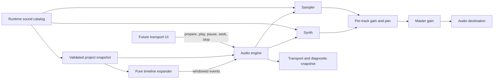

# AgentDAW Audio Engine Design

# 1) Goals

## 1.1 Outcomes

1. Play a validated AgentDAW arrangement from any sixteenth-note step with stable musical timing in a current desktop browser.
2. Render drum tracks through one bundled three-sound sample kit with stable `kick`, `snare`, and `hat` identifiers.
3. Render synth tracks polyphonically through deterministic bass, chord, lead, and pad presets.
4. Apply per-track volume, pan, mute, and solo plus project master volume during playback.
5. Pause, seek, stop, change BPM, and accept live project edits without duplicating scheduled events.
6. Keep editing available when audio is blocked or degraded, and expose actionable local diagnostics.
7. Implement the subsystem with native browser APIs and no new runtime dependencies.

## 1.2 Non-goals

- Playback UI, arrangement UI, drum grid, piano roll, or React state integration.
- Looping, metronome, count-in, swing, tempo automation, or time-signature changes.
- Audio effects, modulation, automation, mastering, or user-editable synth parameters.
- Audio recording, user sample import, arbitrary decoding, or sample editing.
- Offline rendering, WAV encoding, or download behavior.
- MIDI input/output, AudioWorklets, background workers, or plugin architecture.
- Persistence of decoded audio, transport state, diagnostics, or audio nodes.
- Remote telemetry, analytics, health endpoints, or alerting services.

## 1.3 Assumptions and constraints

- The existing project-domain package remains the authority for `Project`, `Track`, `Pattern`, event, arrangement, and `SoundCatalog` types.
- Audio consumes immutable validated project snapshots and never mutates project or history state.
- The project uses 4/4 time with 16 sixteenth-note steps per bar and one global BPM from 40 through 240.
- A pattern is 1, 2, or 4 bars and arrangement clips repeat complete patterns on bar boundaries.
- The target is a current desktop browser with `AudioContext`, `fetch`, `decodeAudioData`, and stereo panning.
- Browser autoplay rules require audio-context creation or resumption from a user gesture.
- The application is a static same-origin deployment with no server, secrets, accounts, or cross-origin sample URLs.
- The project caps of 16 tracks, 128 patterns, 512 events per pattern, 512 arrangement clips, and 256 bars bound all timeline scans.
- Project-domain implementation proceeds in a separate worktree. Audio must import its public contracts after integration rather than duplicate them.
- Only original or CC0 drum assets are permitted; provenance and license terms ship with the assets.

# 2) Glossary

| Term | Meaning |
|---|---|
| Audio clock | Monotonic `AudioContext.currentTime`, used as the scheduling authority. |
| Audio engine | Owner of the browser audio context, transport, mixer graph, scheduler, and active sound sources. |
| Event key | Stable identity for one arrangement occurrence of one pattern event. |
| Look-ahead window | Short future interval for which the scheduler creates Web Audio sources. |
| Mixer bus | One track's gain and stereo-pan node chain. |
| Musical step | One sixteenth note; 16 steps equal one 4/4 bar. |
| Playback anchor | Pair of a musical step and audio-clock time used to calculate current transport position. |
| Preset | Fixed oscillator, filter, envelope, and output configuration selected by stable identifier. |
| Project snapshot | Immutable validated `Project` value consumed by audio without mutation. |
| Timeline event | Deterministic drum hit or synth-note occurrence expanded from an arrangement clip. |
| Transport | Runtime playback state: stopped, playing, paused, or blocked, plus current musical position. |
| Voice | Runtime Web Audio nodes producing one synth note. |

# 3) Technical stack

## 3.1 Language and runtime

- Strict TypeScript using ECMAScript modules.
- Native Web Audio API on the browser main thread.
- Node.js built-in test runner for deterministic logic and thin Web Audio fakes.
- Browser smoke testing for behavior that depends on a real audio device and autoplay policy.

## 3.2 Dependencies

| Package or API | Purpose |
|---|---|
| Web Audio API | Clock, sample decoding, sound sources, synthesis, envelopes, mixing, and stereo output. |
| `fetch` | Load same-origin bundled WAV assets. |
| TypeScript | Existing strict compilation and DOM type declarations. |
| `@types/node` | Existing Node test and assertion declarations. |
| Node test runner | Existing dependency-free unit tests. |

There are no new runtime or development dependencies. Tone.js, standardized audio-context wrappers, fake-audio libraries, and AudioWorklet packages are intentionally excluded.

## 3.3 Project structure

```text
src/
  audio/
    catalog.ts       # Runtime kit and fixed synth preset definitions
    timeline.ts      # Pure arrangement-to-event expansion and timing
    sampler.ts       # Sample loading, decoding, and drum triggering
    synth.ts         # Preset voice creation, lifetime, and voice cap
    engine.ts        # Audio context, transport, scheduling, mixer, diagnostics
    index.ts         # Public audio exports
  project/           # Imported domain contracts; owned by the project package
public/
  demo/
    drums/
      kick.wav
      snare.wav
      hat.wav
      LICENSE.md
test/
  audio.test.ts
```

# 4) Architecture overview

## 4.1 System diagram



## 4.2 Project snapshot ingestion

The application supplies a complete validated project snapshot whenever project state changes. The engine stores only the latest snapshot and synchronizes mixer buses by stable track ID. It derives a bounded composition fingerprint from BPM, instrument selection, patterns, and arrangement; an unchanged fingerprint means only mixer fields changed and playback scheduling can remain intact. A changed fingerprint cancels pending sources and rebuilds from the current musical step.

This separation keeps project validation in the domain package and audio-specific runtime decisions in the audio package. The fingerprint is a linear native serialization over capped data, avoiding a second diff framework or a new cross-package change protocol.

Undo, redo, and restore are application-level history jumps rather than live edits. Their adapter stops the engine before installing the replacement snapshot, so playback remains stopped until the user presses Play again.

## 4.3 Timeline expansion

The pure timeline expander converts the latest project snapshot and a half-open musical-step window into deterministic events. It resolves each arrangement clip, owning pattern, track, and repeated occurrence, then emits only drum hits starting in the window and synth notes overlapping the window. Stable event keys combine clip ID, repeat index, and event ID, so repeated scheduler windows cannot create the same source twice.

The expander performs no Web Audio calls and owns no runtime state. Keeping it pure makes musical timing, boundaries, repeats, and seek behavior testable in Node without an audio device.

## 4.4 Instrument rendering

The sampler maps a drum sound ID to one decoded `AudioBuffer`, creates a one-shot source for each scheduled hit, and routes it to the owning track bus. The synth maps a preset ID and MIDI note to a fixed oscillator, low-pass filter, gain envelope, and track bus. Both components return stoppable runtime sources to the engine, which owns cancellation and cleanup.

Sample buffers are shared across all drum tracks because the MVP has one kit. Synth presets are immutable runtime configuration, not project data or user-editable sound design.

## 4.5 Mixer and output

Each project track has one reusable mixer bus consisting of gain followed by stereo pan. Drum and synth sources connect only to their owning track bus; all track buses connect to one master gain and then the audio destination. Mixer changes ramp gain or pan over 5 milliseconds to reduce clicks without rescheduling musical events.

Track audibility is derived from mute and solo state. A track is audible when it is not muted and either no track is soloed or that track is soloed. Removing a track stops its active sources, disconnects its bus, and removes all runtime references.

## 4.6 Transport and diagnostics

The audio engine owns one transport instance and one `AudioContext`. The audio clock, not `Date.now()` or timer cadence, determines position. A playback anchor maps audio-clock time to musical steps at the current BPM; the scheduler timer merely wakes the engine to fill future audio time.

The engine exposes a read-only transport and diagnostic snapshot. A future UI may read it from `requestAnimationFrame`; the audio package does not own a UI subscription framework or React state.

# 5) External integrations

The subsystem has no third-party service integration. It fetches four same-origin static artifacts: three WAV files and their license document. Asset paths come only from the compile-time runtime catalog; project or WebMCP input cannot provide arbitrary URLs.

Browser audio output is the only platform integration. No permission prompt, OAuth flow, API key, webhook, network backend, or cross-origin request is required.

# 6) Components

## 6.1 Runtime sound catalog

### Responsibility

Define the single basic drum kit, asset paths, and four deterministic synth presets. Provide the domain-facing identifiers used by project validation and the audio-facing rendering configuration used by sampler and synth components.

### Inputs

- Three bundled same-origin WAV asset paths.
- Fixed preset parameters approved in this design.

### Outputs

- Drum kit ID `kit.basic` with `kick`, `snare`, and `hat` sound IDs.
- Synth preset IDs `synth.bass`, `synth.chord`, `synth.lead`, and `synth.pad`.
- A domain-compatible read-only sound catalog projection.

### Error handling and failure modes

| Failure scenario | Behavior | Recovery |
|---|---|---|
| Duplicate catalog ID | Typecheck or catalog test fails before deployment. | Correct the static definition. |
| Asset path absent from deployment | Sample preparation marks the sound unavailable. | Restore the asset and redeploy. |
| Domain and runtime IDs diverge | Catalog contract test fails. | Make the shared projection authoritative. |

### Non-functional requirements

- **Idempotency:** Reading the catalog has no side effects and always returns the same definitions.
- **Latency:** Catalog access is synchronous; only sample preparation performs I/O.
- **Concurrency:** Definitions are immutable and safe for every engine call.

### Notes

The runtime catalog is the single source for sound identifiers. A second manually synchronized domain catalog is not maintained.

## 6.2 Timeline expander

### Responsibility

Expand arrangement clips and pattern repeats into drum and synth occurrences for one requested musical window. Convert project-relative steps into event metadata while remaining independent of Web Audio runtime objects.

### Inputs

- Latest validated project snapshot.
- Half-open start and end positions in musical steps.

### Outputs

- Ordered drum and synth timeline events with stable event keys, owning track IDs, instrument IDs, start steps, and synth duration where applicable.

### Error handling and failure modes

| Failure scenario | Behavior | Recovery |
|---|---|---|
| Missing clip, pattern, or track reference | Skip the occurrence and add an entity-specific diagnostic. | Supply the next validated snapshot. |
| Empty or reversed window | Return no events. | Scheduler supplies a valid future window. |
| Event lies outside its pattern | Skip and diagnose rather than schedule unsafe data. | Correct project data at the domain boundary. |

### Non-functional requirements

- **Idempotency:** Equal project and window inputs produce equal ordered events.
- **Latency:** Complete within one scheduler tick under fixed project caps.
- **Concurrency:** Pure synchronous execution on the main thread.

### Notes

Linear scans are acceptable under the 256-bar and entity caps. No interval tree, precomputed index, or worker is justified for the MVP.

## 6.3 Sampler

### Responsibility

Fetch and decode the three bundled drum samples, cache decoded buffers for the engine lifetime, and schedule one-shot drum sources through the requested track bus.

### Inputs

- Runtime drum catalog.
- Browser audio context.
- Timeline drum events and destination track buses.

### Outputs

- Decoded buffer availability by sound ID.
- Scheduled stoppable drum sources.
- Missing-sample diagnostics.

### Error handling and failure modes

| Failure scenario | Behavior | Recovery |
|---|---|---|
| Fetch fails | Mark only that sound unavailable; other samples continue. | Explicitly prepare again after the asset is available. |
| Decode fails | Mark the sound unavailable and preserve the decode failure message locally. | Replace the invalid asset and prepare again. |
| Hit references unavailable sound | Skip the hit and record its sound ID once per preparation state. | Reload assets; no project mutation occurs. |
| Source stop races with natural end | Treat repeated stop and cleanup as harmless. | None required. |

### Non-functional requirements

- **Idempotency:** Repeated successful preparation reuses existing decoded buffers.
- **Latency:** All three loads may proceed concurrently; playback readiness waits for their settlement, not universal success.
- **Concurrency:** One preparation operation is retained while pending so repeated callers do not duplicate fetches.

### Notes

The sampler has no per-hit velocity, pitch shifting, or choke groups in the MVP.

## 6.4 Synth

### Responsibility

Create deterministic polyphonic voices for MIDI notes using the selected fixed preset. Apply oscillator pitch, low-pass filtering, an amplitude envelope, scheduled release, and bounded voice lifetime.

### Inputs

- Runtime synth preset configuration.
- Browser audio context.
- Timeline synth events and destination track buses.

### Outputs

- Scheduled stoppable synth voices.
- Active voice count and voice-cap diagnostics.

### Error handling and failure modes

| Failure scenario | Behavior | Recovery |
|---|---|---|
| Unknown preset ID | Skip the note and report the preset ID. | Supply a validated project or matching catalog. |
| Voice cap reached | Stop the oldest active voice, preferring one on the requesting track, then create the new voice. | Later notes continue normally. |
| Cancellation occurs during attack or release | Apply the short stop ramp and clean all nodes after oscillator end. | None required. |

### Non-functional requirements

- **Idempotency:** Event-key deduplication in the engine prevents duplicate voice creation.
- **Latency:** Voice graph creation completes synchronously before its scheduled start time.
- **Concurrency:** All voice registry changes occur synchronously on the main thread.

### Notes

One oscillator per note keeps the graph small. Additional oscillators, detune, LFOs, and effects are deferred until the fixed presets prove insufficient.

## 6.5 Audio engine

### Responsibility

Own audio-context lifecycle, transport state, project replacement, scheduling cadence, event deduplication, mixer buses, active sources, and local diagnostics. It is the only public runtime entry point for playback controls.

### Inputs

- Validated project snapshots.
- Prepare, play, pause, seek, stop, and dispose controls.
- Runtime sound catalog.

### Outputs

- Stereo browser audio.
- Read-only transport state and current musical position.
- Local readiness, missing-sample, late-scheduler, and active-voice diagnostics.

### Error handling and failure modes

| Failure scenario | Behavior | Recovery |
|---|---|---|
| Audio context is suspended by autoplay policy | Return blocked status; editing stays available. | Resume from the next user gesture. |
| Context becomes interrupted or closed | Stop transport and clear sources. | Resume an interrupted context or create a new engine after closure. |
| Scheduler wakes after its previous horizon | Drop past drum hits, resume overlapping synth notes with remaining duration, and continue from current step. | Timer cadence normally recovers automatically. |
| Project composition changes while playing | Capture current step, cancel pending sources, install the snapshot, and restart the scheduling anchor. | Continue automatically. |
| Empty arrangement is played | Return `nothing_to_play` without starting a timer. | Add at least one arrangement clip. |

### Non-functional requirements

- **Idempotency:** Stable event keys prevent the same occurrence from being scheduled twice within one transport generation.
- **Latency:** The scheduler normally fills 100 milliseconds of future audio every 25 milliseconds.
- **Concurrency:** Browser main-thread call serialization prevents overlapping transport mutations; no locks are required.

### Notes

Every cancel-and-rebuild increments a transport generation. Scheduled sources from an older generation are stopped and cannot affect the new generation.

# 7) Runtime data model

Audio runtime state is ephemeral and is never stored in project history or IndexedDB.

## 7.1 Runtime sound catalog

| Field | Type | Constraint |
|---|---|---|
| Drum kit ID | string | Exactly `kit.basic`. |
| Drum sounds | ordered definitions | Exactly `kick`, `snare`, and `hat`, each with one same-origin WAV path. |
| Synth preset ID | string | One of `synth.bass`, `synth.chord`, `synth.lead`, or `synth.pad`. |
| Oscillator waveform | Web Audio oscillator type | Fixed per preset. |
| Filter cutoff | positive frequency | Fixed per preset and below the context Nyquist limit when applied. |
| Envelope | attack, decay, sustain, release seconds | Non-negative and fixed per preset. |
| Peak gain | linear gain | Fixed below 1 to leave polyphonic headroom. |

**Stable identifier:** Kit, sound, and preset string IDs are public contracts consumed by project validation and future WebMCP tools.

**Uniqueness:** Every kit, sound, and preset ID is unique within its category.

**Notes:** This catalog is compile-time application data, not a persisted database entity.

## 7.2 Synth preset defaults

| Preset | Waveform | Cutoff | Attack | Decay | Sustain | Release | Peak gain |
|---|---|---:|---:|---:|---:|---:|---:|
| `synth.bass` | sawtooth | 600 Hz | 0.005 s | 0.12 s | 0.55 | 0.12 s | 0.14 |
| `synth.chord` | triangle | 1,800 Hz | 0.02 s | 0.20 s | 0.65 | 0.35 s | 0.11 |
| `synth.lead` | square | 2,800 Hz | 0.005 s | 0.10 s | 0.70 | 0.18 s | 0.10 |
| `synth.pad` | sine | 1,400 Hz | 0.35 s | 0.40 s | 0.75 | 0.80 s | 0.10 |

Filter resonance defaults to 1 for every preset. These are calibration defaults: browser output and the bundled drum levels must be auditioned together, and peak gain may be adjusted before feature freeze without changing preset IDs or project data.

## 7.3 Timeline event

| Field | Type | Constraint |
|---|---|---|
| Event key | string | Stable combination of clip ID, repeat index, and project event ID. |
| Kind | `drum` or `synth` | Matches the owning track and pattern. |
| Track ID | UUID | Existing owning project track. |
| Instrument ID | string | Existing kit or preset ID for the track. |
| Start step | number | Global non-negative musical step. |
| Duration steps | positive number or absent | Present only for synth notes. |
| Sound ID | string or absent | Present only for drum hits. |
| MIDI note | integer or absent | Present only for synth notes; validated project range is 24–96. |

**Stable identifier:** Event key is unique for one arrangement occurrence, including repeated clips.

**Ordering:** Events sort by start step, then track order, then pattern event order for deterministic tests and scheduling.

## 7.4 Transport state

| Field | Type | Constraint |
|---|---|---|
| Status | `stopped`, `playing`, `paused`, `blocked`, or `closed` | One current state. |
| Position step | finite non-negative number | May be fractional while playing. |
| Anchor step | finite non-negative number | Set when playback scheduling starts or restarts. |
| Anchor audio time | finite audio-clock seconds | Valid only while playing. |
| BPM | finite number | Copied from the current project. |
| Generation | non-negative integer | Increments on every cancel-and-rebuild. |
| Arrangement end step | non-negative integer | Derived from the latest valid arrangement. |

**Identity:** One transport state exists per engine instance.

**Lifecycle:** It begins stopped and becomes closed permanently after disposal.

## 7.5 Diagnostic snapshot

| Field | Type | Meaning |
|---|---|---|
| Context state | browser audio-context state | Current platform readiness. |
| Unavailable sounds | sound ID array | Samples that failed fetch or decode. |
| Active voices | integer | Current synth voices, capped at 64. |
| Pending sources | integer | Scheduled drum and synth sources awaiting completion. |
| Late wakeups | integer | Scheduler ticks that woke beyond the scheduled horizon. |
| Last issue | structured local issue or absent | Latest actionable audio problem with entity or sound context. |

Diagnostics contain no raw audio, user text, project history, or remote telemetry identifiers.

# 8) Storage artifacts

| Artifact | Location | Contents | Lifecycle |
|---|---|---|---|
| Kick sample | `public/demo/drums/kick.wav` | One normalized original or CC0 one-shot. | Ships with each deployment. |
| Snare sample | `public/demo/drums/snare.wav` | One normalized original or CC0 one-shot. | Ships with each deployment. |
| Hi-hat sample | `public/demo/drums/hat.wav` | One normalized original or CC0 one-shot. | Ships with each deployment. |
| Sample license | `public/demo/drums/LICENSE.md` | Provenance, author or generator, source, and permitted license. | Retained with every distributed sample. |

Decoded `AudioBuffer` objects exist only in memory for one engine lifetime. They are not stored in IndexedDB, project JSON, history snapshots, or service-worker caches by this subsystem.

# 9) Core algorithms and workflows

## 9.1 Musical timing conversion

### Purpose

Map between project musical steps and audio-clock seconds at one global BPM.

### Inputs

- Project BPM.
- Musical step or audio-clock time.
- Current playback anchor.

### Procedure

1. Calculate beat duration as `60 / BPM` seconds.
2. Calculate step duration as beat duration divided by 4.
3. Convert a musical position to seconds relative to the anchor.
4. Convert current audio-clock time to a fractional musical position for UI state and scheduler windows.
5. Clamp seeks to the inclusive range from step 0 through the arrangement end step.

### Configurable parameters

| Parameter | Default | Description |
|---|---:|---|
| Steps per beat | 4 | Fixed sixteenth-note quantization. |
| Beats per bar | 4 | Fixed 4/4 meter. |
| Playback start lead | 50 ms | Time for node creation before the first source starts; tune if slow devices miss initial events. |

### Error handling

| Failure | Behavior | Recovery |
|---|---|---|
| Non-finite or out-of-range BPM | Refuse playback and report invalid project state. | Supply a domain-validated snapshot. |
| Seek exceeds arrangement | Clamp to arrangement end. | UI reflects the clamped position. |

### Idempotency

Equal BPM, anchor, and position inputs produce equal conversions.

### Notes

BPM automation is excluded, so one linear mapping covers the entire current project snapshot.

## 9.2 Arrangement expansion

### Purpose

Produce deterministic timeline events for only the scheduler's requested window.

### Inputs

- Validated project snapshot.
- Half-open window `[startStep, endStep)`.

### Procedure

1. Build bounded lookups for tracks and patterns by ID.
2. Visit arrangement clips in stable project order.
3. Convert each clip start bar to its global start step.
4. For each repeat, offset the pattern by its pattern length in steps.
5. For a drum hit, emit the occurrence when its global start lies in the requested window.
6. For a synth note, emit when its duration overlaps the requested window.
7. When the synth note began before the window, start a new voice at the window boundary with the normal preset attack and only the note's remaining duration.
8. Sort emitted events by start step, track order, and pattern event order.

### Configurable parameters

| Parameter | Default | Description |
|---|---:|---|
| Maximum arrangement bars | 256 | Inherited project-domain cap. |
| Maximum clips | 512 | Inherited project-domain cap. |

### Error handling

| Failure | Behavior | Recovery |
|---|---|---|
| Missing reference | Skip and diagnose the offending entity. | Replace with validated state. |
| Invalid event bounds | Skip the event. | Correct state through the project service. |
| Empty window | Return an empty event array. | None required. |

### Idempotency

The same project and window produce the same ordered event values and keys.

### Notes

The bounded linear scan is intentionally simple. Add indexing only if real profiling shows scheduler work exceeding its 25-millisecond cadence.

## 9.3 Look-ahead scheduling

### Purpose

Create Web Audio sources shortly before they must play while remaining resilient to ordinary JavaScript timer jitter.

### Inputs

- Current project and playback anchor.
- Audio clock.
- Timeline expander.
- Set of pending event keys.

### Procedure

1. On play, set the audio start time to current audio time plus the start lead and create a new transport generation.
2. Run an immediate scheduling tick, then start the periodic timer.
3. On each tick, calculate current musical position from the audio clock.
4. Convert the next 100 milliseconds of audio time into a musical-step window.
5. Expand that window and discard event keys already pending in the current generation.
6. Schedule remaining events at exact audio-clock times and retain their stoppable sources.
7. Remove source and key records when each source ends.
8. Stop transport when audio time reaches the derived arrangement end; already-started synth release tails may finish naturally.

### Configurable parameters

| Parameter | Default | Description |
|---|---:|---|
| Scheduler tick | 25 ms | Main-thread wake cadence; lower only if profiling shows timing gaps. |
| Look-ahead | 100 ms | Future audio already scheduled; raise for slow devices at the cost of slower edit response. |
| Stop ramp | 5 ms | Prevents clicks during cancellation and mixer changes. |

### Error handling

| Failure | Behavior | Recovery |
|---|---|---|
| Tick wakes after scheduled horizon | Increment late-wakeup count, skip elapsed drum hits, and rebuild from the current step. | Normal cadence resumes automatically. |
| Source creation fails | Record the affected event and continue scheduling siblings. | Future ticks continue. |
| Context is not running | Enter blocked or stopped state and clear the timer. | Resume from a user gesture. |

### Idempotency

Event keys plus transport generation prevent duplicate sources when scheduler windows overlap or transport is rebuilt.

### Notes

`setInterval` is only a wake mechanism. All audible start times use the audio clock.

## 9.4 Transport controls

### Purpose

Provide predictable prepare, play, pause, seek, stop, and dispose behavior.

### Inputs

- User-gesture preparation request.
- Latest project snapshot.
- Requested transport control and optional target step.

### Procedure

1. Prepare creates or resumes the context and settles all sample loads.
2. Play refuses an empty arrangement, clamps the requested step, and schedules from that position.
3. Pause captures current musical position, cancels sources with a short ramp, clears the timer, and retains the position.
4. Seek clamps the target, cancels pending sources, and either remains paused or restarts immediately when previously playing.
5. Stop cancels sources and resets position to step 0.
6. Dispose performs stop behavior, disconnects nodes, releases buffers and registries, closes the context, and permanently marks the instance closed.

### Configurable parameters

| Parameter | Default | Description |
|---|---|---|
| Stop reset position | Step 0 | Fixed MVP behavior. |

### Error handling

| Failure | Behavior | Recovery |
|---|---|---|
| Prepare is not initiated by a usable gesture | Return blocked state. | Retry from a click or key gesture. |
| Control follows disposal | Reject with a closed-engine error. | Create a new engine instance. |
| Play occurs before preparation | Attempt context readiness only when the call is gesture-backed; otherwise block. | Prepare from a user gesture. |

### Idempotency

Pausing an already paused engine, stopping an already stopped engine, or disposing an already closed engine causes no additional side effects.

## 9.5 Live project replacement

### Purpose

Apply immutable project updates without unnecessary audible interruption.

### Inputs

- Current project snapshot.
- Replacement validated project snapshot.
- Current transport and mixer state.

### Procedure

1. Synchronize track buses and apply volume, pan, mute, solo, and master gain from the replacement snapshot.
2. Calculate the replacement composition fingerprint from BPM, track kind and instrument, patterns, and arrangement.
3. If the fingerprint is unchanged, retain all scheduled sources because only mixer values changed.
4. If the fingerprint changed while stopped or paused, install the replacement without scheduling.
5. If the fingerprint changed while playing, capture the current step using the old anchor, cancel sources, install the replacement, clamp the step to its new end, and restart from that step.
6. When only BPM changed, the captured musical step is preserved and a new seconds-per-step mapping begins from the restart anchor.

### Configurable parameters

| Parameter | Default | Description |
|---|---|---|
| Fingerprint algorithm | Native deterministic serialization | Bounded O(n) comparison without an added diff library. |

### Error handling

| Failure | Behavior | Recovery |
|---|---|---|
| Replacement has invalid references | Skip unsafe events and expose diagnostics; do not mutate the supplied snapshot. | Project service supplies validated state. |
| Current position exceeds shortened arrangement | Clamp to the new arrangement end and stop if already at the end. | User may seek elsewhere. |

### Idempotency

Replacing with the same project data leaves scheduling and mixer graph topology unchanged.

### Notes

Linear fingerprinting is a deliberate MVP ceiling. Replace it with explicit domain change metadata only if commit profiling shows meaningful cost.

Undo, redo, and restore callers stop transport before replacement. This keeps history behavior explicit without adding a flag or history concepts to the audio engine.

## 9.6 Voice allocation and cleanup

### Purpose

Bound synth CPU and memory while allowing chords and overlapping releases.

### Inputs

- New synth timeline event.
- Active voice registry.

### Procedure

1. Remove any voices whose oscillators have ended.
2. When fewer than 64 voices are active, create the new voice.
3. At the cap, select the oldest active voice on the requesting track when available; otherwise select the oldest voice globally.
4. Ramp the selected voice to silence, stop it, and remove it from the registry.
5. Create and register the new voice.
6. On natural or forced end, disconnect all voice nodes and remove their runtime references.

### Configurable parameters

| Parameter | Default | Description |
|---|---:|---|
| Global live voice cap | 64 | Protects browser resources across all synth tracks. |

### Error handling

| Failure | Behavior | Recovery |
|---|---|---|
| Voice node creation fails | Skip the note and record its event key. | Later events continue. |
| End callback repeats cleanup | Cleanup is guarded and becomes a no-op. | None required. |

### Idempotency

Only one voice may exist for one pending event key and transport generation.

## 9.7 Mixer synchronization

### Purpose

Keep the Web Audio mixer graph aligned with project tracks while applying volume, pan, mute, solo, and master gain without rebuilding the musical timeline.

### Inputs

- Ordered project tracks and master volume.
- Existing track buses and active sources.

### Procedure

1. Create one gain-and-pan bus for each track ID that lacks a bus.
2. Determine whether any project track is soloed.
3. Set a track's target gain to zero when it is muted or another track is exclusively soloed.
4. Otherwise convert its decibel volume to linear gain with `10^(dB/20)`.
5. Ramp track gain and pan from their current values to their new targets over 5 milliseconds.
6. Convert master decibels with the same formula and ramp the master gain.
7. Stop sources, disconnect nodes, and remove buses whose track IDs no longer exist.

### Configurable parameters

| Parameter | Default | Description |
|---|---:|---|
| Mixer ramp | 5 ms | Reduces clicks while keeping controls responsive. |

### Error handling

| Failure | Behavior | Recovery |
|---|---|---|
| Non-finite mixer value reaches audio | Retain the previous safe target and record the track or master field. | Supply a domain-validated snapshot. |
| A bus cannot be created | Silence and diagnose only the affected track. | Recreate the engine if the context is unhealthy. |

### Idempotency

Applying equal track and master data retains the same bus topology and parameter targets.

### Notes

Muted gain is exactly zero. A validated `-60 dB` unmuted value remains a very quiet non-zero level rather than acquiring separate mute semantics.

# 10) Public module contracts

The audio package exposes one engine boundary and the read-only runtime sound catalog. Exact TypeScript signatures belong in the implementation plan; these behavioral contracts are stable.

| Operation | Input | Successful result | Expected failure |
|---|---|---|---|
| Create engine | Runtime sound catalog | Stopped engine without eagerly starting audio | Unsupported Web Audio environment |
| Prepare | User-gesture call | Ready or degraded status plus unavailable sounds | Blocked or closed context |
| Replace project | Validated project snapshot | Mixer synchronized; playback retained or rebuilt | Invalid snapshot diagnostic |
| Play | Optional musical step | Playing status or `nothing_to_play` | Blocked or closed engine |
| Pause | None | Paused position | Closed engine |
| Seek | Musical step | Clamped paused or playing position | Closed engine |
| Stop | None | Stopped at step 0 | Closed engine |
| Read state | None | Immutable transport and diagnostic snapshot | None |
| Dispose | None | Closed engine with released runtime resources | None; repeat is a no-op |

Expected runtime failures return specific structured status or issue information with sound, entity, or event context. Unexpected programmer errors are not converted into successful results.

# 11) Security and privacy

- No authentication, authorization, secrets, cookies, or backend requests exist in this subsystem.
- Sample URLs are compile-time same-origin paths; untrusted project or WebMCP input cannot cause arbitrary network fetches.
- The project-domain boundary validates IDs, ranges, references, and caps before audio consumption.
- The engine still skips unsafe stale references to prevent malformed runtime state from crashing playback.
- Diagnostics remain local and contain identifiers and failure messages, never raw audio or user-authored text.
- Browser output is transient; this subsystem stores no project or audio data.
- Only original or CC0 sample assets with recorded provenance may ship.

# 12) Operational guardrails

## 12.1 Caps and defaults

| Guardrail | Default |
|---|---:|
| Audio engine instances per editor | 1 |
| Drum samples | 3 |
| Synth presets | 4 |
| Global live synth voices | 64 |
| Scheduler tick | 25 ms |
| Look-ahead window | 100 ms |
| Playback start lead | 50 ms |
| Gain stop/change ramp | 5 ms |
| Project tracks | 16 |
| Arrangement end | 256 bars |

## 12.2 Local runtime metrics

- Audio-context state.
- Transport status and current musical step.
- Unavailable sample IDs.
- Active synth voice count.
- Pending source count.
- Late scheduler wakeup count.
- Latest structured audio issue.

## 12.3 Health and alerting

There is no remote monitoring service or health endpoint for the static MVP. The read-only diagnostic snapshot provides local health:

| State | Condition | User-visible action |
|---|---|---|
| Ready | Context running and all samples decoded. | Play normally. |
| Degraded | Context usable with one or more unavailable samples. | Name missing sounds; allow playback. |
| Blocked | Context suspended or preparation lacks a usable gesture. | Prompt the user to enable audio. |
| Closed | Engine disposed or context irrecoverably closed. | Recreate the editor audio engine. |

Repeated late wakeups are diagnostic information, not a remote alert. Raise look-ahead only after reproducing audible gaps on target hardware.

# 13) Retention and lifecycle

- Runtime sound catalog definitions live for the loaded application bundle.
- Decoded buffers live from successful preparation until engine disposal.
- Mixer buses live while their project track exists or until disposal.
- Drum sources live until their buffer ends or transport cancels them.
- Synth voices live through their scheduled release, forced eviction, transport cancellation, or disposal.
- Pending event keys live only for one transport generation and are removed with source cleanup.
- Transport and diagnostics reset when a new engine is created and are never persisted.
- Sample WAV and license artifacts remain with the deployed static build until replaced by a later deployment.

# 14) Deployment and infrastructure

## 14.1 Infrastructure

No infrastructure-as-code resources are required. The audio TypeScript and drum assets ship inside the existing static web deployment.

## 14.2 CI/CD pipeline

1. Install the repository's existing development dependencies.
2. Run the focused Node audio tests.
3. Run the complete test suite.
4. Run strict TypeScript checking.
5. Build the production web application after the application shell exists.
6. Verify the three WAV paths are included in the static build.
7. Perform the browser audio smoke path before feature freeze.
8. Deploy through the existing static hosting workflow.

## 14.3 Bootstrap and one-time setup

1. Add three original or CC0 normalized one-shot WAV files.
2. Record provenance and license details beside the assets.
3. Audition sample and preset levels together on target desktop hardware.
4. Calibrate fixed peak gains if clipping or severe imbalance is audible.

## 14.4 Rollback

Rollback uses the hosting provider's prior static deployment. Project data remains compatible because audio introduces no persisted schema and preset or kit IDs are stable.

# 15) Decision log

## 15.1 Decision: Native Web Audio without a runtime library

**Context:** The MVP needs sample playback, synthesis, scheduling, and mixing in one browser.

**Decision:** Use native Web Audio and browser APIs directly with no new dependency.

**Alternatives considered:**
- Tone.js — reduces some API boilerplate but adds a large abstraction and dependency for a small fixed engine.
- A custom audio framework — creates ownership and testing cost without another product consumer.

**Trade-offs:** The project owns a small amount of scheduling and node-lifecycle code, but controls its timing and failure behavior explicitly.

## 15.2 Decision: Main-thread look-ahead scheduler

**Context:** JavaScript timers can wake late, but Web Audio sources can be scheduled against a stable audio clock.

**Decision:** Wake every 25 milliseconds and schedule 100 milliseconds ahead on the main thread.

**Alternatives considered:**
- AudioWorklet scheduling — improves isolation but adds a second execution context, message protocol, build concerns, and harder tests.
- Schedule the entire arrangement at play time — makes live edits, pause, and seek expensive and slow to react.

**Trade-offs:** Severe main-thread stalls may create gaps; late-wakeup recovery and a tunable look-ahead window bound the risk.

## 15.3 Decision: Pure windowed timeline expansion

**Context:** Arrangement playback must handle repeats, boundary conditions, seek, and scheduler overlap deterministically.

**Decision:** Expand only the requested musical window in a pure synchronous component.

**Alternatives considered:**
- Precompute the full song — duplicates state and must be invalidated on every composition edit.
- Let sampler and synth traverse project state — couples musical structure to audio-node lifecycle and duplicates traversal logic.

**Trade-offs:** The scheduler performs bounded linear scans, which is acceptable under fixed MVP caps.

## 15.4 Decision: One fixed kit and four fixed presets

**Context:** Users need enough sounds to compose a basic instrumental before the September deadline.

**Decision:** Ship `kick`, `snare`, and `hat` plus bass, chord, lead, and pad presets with stable IDs.

**Alternatives considered:**
- A larger kit and preset library — adds asset licensing, tuning, UI, and test surface.
- User-editable synthesis — turns the milestone into a sound-design product.

**Trade-offs:** Timbre variety is intentionally limited; additional sounds remain stretch scope.

## 15.5 Decision: Musical-step transport position

**Context:** BPM may change while playback is running and the editor seeks on a quantized musical grid.

**Decision:** Store transport position in musical steps and derive seconds from the current BPM and audio anchor.

**Alternatives considered:**
- Store only elapsed seconds — BPM changes would shift the user's musical position.
- Store bars and steps separately — adds representation and normalization complexity without benefit.

**Trade-offs:** Position may be fractional during playback, so UI display must round or format it without changing the engine state.

## 15.6 Decision: Bounded composition fingerprint

**Context:** Mixer-only changes should not cancel musical sources, while composition changes must rebuild scheduling.

**Decision:** Compare a deterministic native serialization of BPM, instruments, patterns, and arrangement.

**Alternatives considered:**
- Deep-compare the complete project — mixer changes would appear composition-changing.
- Add an audio-specific change protocol to the project service — couples independent packages and complicates undo or restore integration.

**Trade-offs:** Each project replacement performs an O(n) bounded serialization. Replace it only if profiling shows material cost.

# 16) Implementation checklist

## 16.1 Catalog and assets

- [ ] Add failing tests for stable unique kit, sound, and preset identifiers.
- [ ] Add the runtime catalog and its domain-compatible projection.
- [ ] Add kick, snare, and hi-hat WAV assets with provenance and license documentation.
- [ ] Verify all catalog asset paths exist in the production build.

## 16.2 Timeline and timing

- [ ] Add failing tests for BPM conversion and fractional playback position.
- [ ] Add failing tests for clip repeats, event ordering, half-open boundaries, and empty windows.
- [ ] Add failing tests for seek into an overlapping synth note without replaying past drums.
- [ ] Implement the pure timeline expander and stable event keys.

## 16.3 Sampler and synth

- [ ] Add failing tests with thin Web Audio fakes for concurrent preparation, missing samples, and buffer reuse.
- [ ] Implement sampler preparation, triggering, stopping, and cleanup.
- [ ] Add failing tests for preset selection, MIDI pitch, release scheduling, and cap eviction preference.
- [ ] Implement the four fixed synth presets and bounded voice registry.

## 16.4 Engine, transport, and mixer

- [ ] Add failing tests for play, pause, seek, stop, end-of-arrangement, and idempotent controls.
- [ ] Add failing tests for mute/solo precedence, dB conversion, pan, and bus deletion.
- [ ] Add failing tests for overlapping scheduler windows, late wakeups, generation cancellation, and missing references.
- [ ] Implement the audio context, mixer graph, transport anchor, look-ahead scheduler, and diagnostics.
- [ ] Implement project fingerprinting and mixer-only versus composition-change behavior.
- [ ] Implement disposal and closed-engine errors.

## 16.5 Integration and verification

- [ ] Integrate the completed project-domain public contracts without duplicating types.
- [ ] Run focused audio tests after each implementation slice.
- [ ] Run the complete test suite and strict type checking.
- [ ] Run browser smoke checks for autoplay blocking, audible kit and presets, chords, pause, seek, BPM change, live edits, missing sample degradation, and disposal.
- [ ] Inspect the final diff for unrelated changes and added dependencies.

# 17) Summary

- One native main-thread Web Audio engine owns playback and runtime audio state.
- A pure windowed timeline expander converts validated project data into deterministic events.
- One bundled kit provides kick, snare, and hi-hat through decoded WAV buffers.
- Four fixed polyphonic presets provide bass, chord, lead, and pad voices.
- Per-track gain and pan feed one master gain and stereo destination.
- Musical-step transport preserves position across BPM changes.
- A 25-millisecond timer schedules 100 milliseconds ahead against the audio clock.
- Stable event keys and transport generations prevent duplicate or stale sources.
- Mixer-only changes preserve scheduling; composition changes rebuild from the current step.
- Missing samples and blocked audio degrade playback without disabling editing.
- A global 64-voice cap bounds synth resources and evicts the oldest suitable voice.
- Runtime state and decoded audio are ephemeral and never enter project history or persistence.
- Node tests cover deterministic behavior; a browser smoke path covers real audio and autoplay policy.
- No new libraries, workers, services, storage schemas, or infrastructure are introduced.
