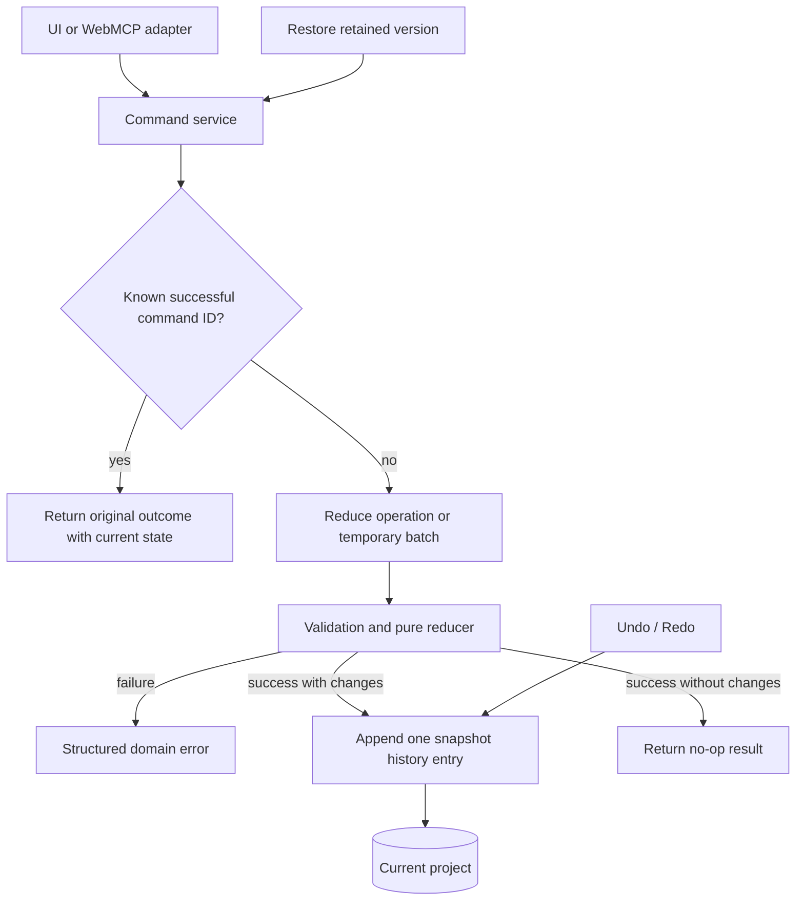

# AgentDAW Project Domain Design

# 1) Goals

## 1.1 Outcomes

1. Represent an AgentDAW project as strict, immutable, JSON-serializable TypeScript data.
2. Support the complete project mutation surface for project settings, tracks, patterns, drum hits, synth notes, and arrangement clips.
3. Route single operations and ordered batches through the same validation and mutation path.
4. Commit a batch atomically as one attributed history entry or leave all state unchanged.
5. Provide snapshot-based history with undo, redo, redo invalidation, retention, and non-destructive restore.
6. Keep the package independent of React, audio, WebMCP, IndexedDB, and other application adapters.

## 1.2 Non-goals

- UI state, React integration, or editor gestures.
- Playback, scheduling, synthesis, samples, or WAV export.
- IndexedDB persistence or schema migration beyond a project schema version field.
- WebMCP tool registration or transport-specific schemas.
- Cloud sync, concurrent editing, branches, or selective history rewriting.
- Event sourcing, inverse-command generation, or persistent command deduplication across pruned history.

## 1.3 Assumptions and constraints

- The package runs in current Node.js for tests and a current desktop browser in production.
- A command producer allocates UUIDs for commands and entities before dispatch so later operations in the same batch can reference earlier creations.
- A read-only sound catalog is supplied to validation; the package does not load audio assets.
- All project mutations occur serially through one command service instance.
- Project and history caps match `docs/design.md`.
- TypeScript and Node type declarations are the only development dependencies required for this milestone.

# 2) Glossary

| Term | Meaning |
|---|---|
| Command | Dispatch envelope containing attribution and one operation, an ordered batch, or a restore request. |
| Operation | One typed request to mutate project data. |
| Command service | Owner of the current project, history timeline, and idempotency behavior. |
| Reducer | Pure domain component that validates and applies one operation to a project. |
| Snapshot | Complete immutable project value captured before or after a commit. |
| Cascade | Explicit deletion of entities owned by or referencing the requested deletion target. |
| History cursor | Position of the latest currently applied history entry. |
| Restore | New commit whose resulting state equals a retained entry's `after` snapshot. |
| Sound catalog | Read-only set of valid drum-kit, drum-sound, and synth-preset identifiers. |

# 3) Technical stack

## 3.1 Language and runtime

- Strict TypeScript using ECMAScript modules.
- Node.js built-in test runner.
- Native `crypto.randomUUID()` at command-producing adapters.
- No runtime dependencies.

## 3.2 Dependencies

| Package | Purpose |
|---|---|
| `typescript` | Strict compilation and type checking. |
| `@types/node` | Type declarations for Node's test and assertion modules. |

## 3.3 Project structure

```text
src/project/
  model.ts       # Project entities, sound catalog, and caps
  commands.ts    # Operation, dispatch, change-summary, and result types
  reducer.ts     # Validation and immutable project mutations
  service.ts     # Dispatch, batches, idempotency, and history controls
  errors.ts      # Structured domain failures
  index.ts       # Public package exports
test/
  project.test.ts
package.json
tsconfig.json
```

# 4) Architecture overview



## 4.1 Command production

An adapter creates a command ID, attribution, label, and complete operation data. Entity IDs are allocated before dispatch, which lets an atomic batch create a track and then reference that track from later pattern operations without temporary-reference syntax. Duplicate-pattern operations supply a destination pattern ID and fresh IDs for copied events. The adapter performs no authoritative domain validation.

## 4.2 Reduction

The reducer receives a project, sound catalog, and one complete operation. It verifies the operation and all affected project invariants, then returns a new project and change summary without mutating its inputs. It does not know about history, timestamps, command IDs, or command sources.

## 4.3 Commit

The command service reduces a direct operation once or reduces batch members in order against temporary state. A failure returns the responsible field and batch index and discards the temporary state. A successful state change appends one history entry and becomes current; a successful no-op creates no history entry.

## 4.4 History control

Undo and redo replace the current project from retained snapshots and move the cursor without creating activity entries. Restore dispatches a new attributed commit whose target is a retained entry's `after` snapshot. New commits after undo discard entries ahead of the cursor.

# 5) External integrations

This package has no external service integration. Future UI, WebMCP, persistence, and audio packages consume its public types and results without receiving alternate mutation paths.

# 6) Components

## 6.1 Project model

### Responsibility

Define serializable project entities, their relationships, the sound catalog shape, and fixed MVP caps. Runtime state such as playback, selection, decoded audio, history position, and save status is excluded.

### Inputs

- Initial project data from a project factory, demo asset, or future persistence adapter.
- Read-only sound catalog data supplied by the application composition root.

### Outputs

- Strict project and entity values used by every domain operation.

### Error handling and failure modes

| Failure | Behavior | Recovery |
|---|---|---|
| Unsupported schema version | Reject before service creation. | Migrate through a future persistence boundary or open a supported project. |
| Invalid initial project | Reject with the first actionable invariant failure. | Correct or replace the supplied data. |

### Non-functional requirements

- **Serialization:** Every value is compatible with structured clone and JSON.
- **Immutability:** Public model types are read-only and reducers do not mutate inputs.
- **Ordering:** Tracks, patterns, events, and arrangement clips preserve explicit array order.

## 6.2 Reducer and validation

### Responsibility

Validate and apply one operation. Validation includes local field rules, referenced-entity rules, ownership, kind compatibility, caps, event bounds, arrangement bounds, and same-track overlap.

### Inputs

- Current project snapshot.
- One complete operation.
- Read-only sound catalog.

### Outputs

- New project and created/updated/deleted entity summary when valid.
- Structured domain error when invalid.

### Error handling and failure modes

| Failure | Behavior | Recovery |
|---|---|---|
| Invalid field or numeric range | Reject without a project result. | Correct the named field. |
| Entity or catalog ID missing | Reject with the missing ID and field path. | Inspect current state or catalog and retry. |
| Cap exceeded | Reject before committing allocation. | Remove content or submit a smaller change. |
| Event outside pattern | Reject the operation. | Move, resize, or remove the event first. |
| Arrangement overlap | Reject with both conflicting clip IDs. | Move, shorten, or remove a conflicting clip. |

### Non-functional requirements

- **Determinism:** Equal project, operation, and catalog inputs produce equal outputs.
- **Side effects:** None.
- **Complexity:** Linear scans are acceptable under fixed MVP caps.

## 6.3 Command service

### Responsibility

Own current project state, serialize mutations, coordinate atomic batches, record successful command IDs, and create history entries.

### Inputs

- Attributed direct commands and batches.
- Undo, redo, and restore requests.

### Outputs

- Current project and history view.
- Commit or no-op result with a change summary.
- Structured failure with optional batch index.

### Error handling and failure modes

| Failure | Behavior | Recovery |
|---|---|---|
| Batch member fails | Discard all temporary states. | Correct the indexed operation and retry. |
| Reused successful command ID | Return the original outcome metadata with the current service state and no mutation. | Continue using a new ID for a new intent. |
| Nothing to undo or redo | Return a specific boundary result. | Disable the unavailable control. |
| Restore target was pruned | Return a not-found failure. | Choose a retained entry. |

### Non-functional requirements

- **Atomicity:** One dispatch produces zero or one state/history commit.
- **Idempotency:** The 100 most recent successful command outcomes, including no-ops, are deduplicated independently of history retention.
- **Concurrency:** JavaScript's synchronous call execution serializes commits; multi-tab coordination is outside scope.

## 6.4 History timeline

### Responsibility

Retain attributed before/after snapshots and track which entries are currently applied.

### Inputs

- Successful state-changing commits.
- Undo and redo controls.

### Outputs

- Up to 100 chronological entries.
- Cursor movement and replacement project snapshots.

### Error handling and failure modes

| Failure | Behavior | Recovery |
|---|---|---|
| Retention cap reached | Remove the oldest entry before appending. | Older versions are no longer restorable. |
| New commit occurs after undo | Remove all entries after the cursor. | Continue on the new linear timeline. |

### Non-functional requirements

- **Atomicity:** Snapshot entry and current project change together.
- **Serialization:** Timeline state is suitable for later IndexedDB storage.
- **Bounded memory:** At most 100 complete entries are retained.

# 7) Data model

## 7.1 `Project`

| Field | Type | Constraint |
|---|---|---|
| `schemaVersion` | integer | Equals the supported version. |
| `id` | UUID string | Stable and non-empty. |
| `name` | string | Trimmed length 1–80. |
| `bpm` | number | Finite, 40–240. |
| `masterVolumeDb` | number | Finite, -60–0. |
| `tracks` | readonly `Track[]` | Ordered, unique IDs, at most 16. |
| `patterns` | readonly `Pattern[]` | Ordered, unique IDs, at most 128. |
| `arrangement` | readonly `ArrangementClip[]` | Ordered, unique IDs, at most 512. |

## 7.2 `Track`

| Field | Type | Constraint |
|---|---|---|
| `id` | UUID string | Unique within all track IDs. |
| `name` | string | Trimmed length 1–40. |
| `kind` | `drum` or `synth` | Immutable after creation. |
| `instrumentId` | string | Existing drum kit or synth preset of the matching kind. |
| `volumeDb` | number | Finite, -60–6. |
| `pan` | number | Finite, -1–1. |
| `muted` | boolean | Mixer state. |
| `soloed` | boolean | Mixer state. |

Track kind is immutable. Changing a drum track's kit is rejected when existing hits use sounds absent from the new kit.

## 7.3 `Pattern`

Patterns are a discriminated drum/synth union. The pattern kind must match its owning track.

| Field | Type | Constraint |
|---|---|---|
| `id` | UUID string | Unique among patterns. |
| `trackId` | UUID string | Existing matching-kind track. |
| `name` | string | Trimmed length 1–40. |
| `kind` | `drum` or `synth` | Matches track and content. |
| `lengthBars` | `1`, `2`, or `4` | Defines 16, 32, or 64 valid steps. |
| `events` | drum hits or synth notes | Matching kind, unique IDs, at most 512. |

Pattern ownership and kind are immutable. Duplication keeps the same owner and requires fresh destination IDs for the pattern and every copied event.

## 7.4 Pattern events

| Entity | Fields | Constraint |
|---|---|---|
| Drum hit | ID, sound ID, start step | Sound belongs to the track kit; step is in range. |
| Synth note | ID, MIDI note, start step, length steps | MIDI 24–96; positive length; end is within pattern. |

Multiple hits or notes may share a start step. Synth-note overlap is allowed for chords.

## 7.5 `ArrangementClip`

| Field | Type | Constraint |
|---|---|---|
| `id` | UUID string | Unique among clips. |
| `patternId` | UUID string | Existing pattern. |
| `startBar` | integer | At least zero. |
| `repeatCount` | integer | 1–64. |

Clip duration is `pattern.lengthBars × repeatCount`. Its end may not exceed bar 256. Clips on the same inferred track may not overlap; clips on different tracks may overlap.

## 7.6 `HistoryEntry`

| Field | Type | Constraint |
|---|---|---|
| `id` | UUID string | Unique retained history ID. |
| `commandId` | UUID string | ID of the successful dispatch. |
| `source` | `manual` or `agent` | Dispatch-path attribution. |
| `label` | string | Non-empty user-readable summary. |
| `createdAt` | integer | Unix milliseconds. |
| `action` | operation, operation array, or restore descriptor | Exact committed direct, batch, or restore intent. |
| `before` | `Project` | State immediately before commit. |
| `after` | `Project` | State immediately after commit. |
| `changes` | change summary | All direct and cascaded entity IDs. |

# 8) Storage artifacts

No storage is implemented in this milestone. Project, history entries, cursor, and retained idempotency results are structured-clone-compatible so a later IndexedDB adapter can persist them without changing domain semantics.

# 9) Core workflows

## 9.1 Direct command

### Purpose

Apply one attributed project mutation.

### Procedure

1. Check whether the command ID has a retained successful outcome.
2. If found, return that outcome metadata with current service state and no mutation.
3. Reduce the operation against current state.
4. On validation failure, return the structured error and retain no command-ID record.
5. If output equals current state, return a no-op result without history.
6. Otherwise append one history entry, update current state, and retain the result by command ID.

### Error handling

Expected domain failures change no service state. Unexpected programming failures propagate rather than being mislabeled as validation errors.

### Idempotency

A retained successful command ID always returns its original commit or no-op metadata while exposing the current project separately. Failed command IDs may be retried after correcting their payload.

## 9.2 Atomic batch

### Purpose

Apply related operations as one mutation and one undoable action.

### Procedure

1. Check command-ID idempotency.
2. Start with the current project as temporary state.
3. Reduce each operation in order against the latest temporary state.
4. On failure, attach the zero-based batch index and discard the temporary state.
5. Merge each operation's change summary, including cascade effects.
6. If every operation is a no-op, return without history.
7. Otherwise commit the final state and one entry containing all operations.

### Error handling

A reference to an entity removed by an earlier cascade fails at that later batch index and rolls back the entire batch.

### Idempotency

The batch command ID identifies the whole transaction; individual member operations do not have separate idempotency records.

## 9.3 Cascading deletion

### Purpose

Make deletion match beginner expectations without leaving invalid references.

### Procedure

1. Deleting a track finds every pattern owned by that track.
2. It finds every arrangement clip referencing those patterns.
3. It removes the clips, patterns, and track in one reducer result.
4. Deleting a pattern similarly removes every referencing arrangement clip and the pattern.
5. Deleting an arrangement clip or pattern event has no cascade.
6. Return every deleted ID grouped by entity type.

### Error handling

The whole deletion is rejected before mutation if the command target does not exist. Capacity cannot fail during deletion.

### Idempotency

Dispatch-level command ID deduplication prevents a repeated successful delete from becoming a not-found failure.

## 9.4 Pattern-length update

### Purpose

Change pattern duration without truncating content or creating arrangement conflicts.

### Procedure

1. Validate that the new length is 1, 2, or 4 bars.
2. Reject a shrink when any hit or note would fall outside the new step range.
3. Recalculate every arrangement clip referencing the pattern.
4. Reject if any recalculated clip exceeds bar 256 or overlaps another clip on its track.
5. Apply the pattern update.

### Error handling

Errors identify the offending event or conflicting arrangement clips. Existing content is never truncated implicitly.

### Idempotency

Setting the existing length is a no-op.

## 9.5 Undo and redo

### Purpose

Move linearly through retained committed states.

### Procedure

1. Undo reads the entry at the cursor, installs its `before` snapshot, and decrements the cursor.
2. Redo reads the entry immediately after the cursor, installs its `after` snapshot, and increments the cursor.
3. At either boundary, return a specific unavailable result without mutation.

### Idempotency

Undo and redo are controls rather than idempotent commands; repeated calls intentionally continue moving until the boundary.

## 9.6 Restore

### Purpose

Return to a retained version without rewriting activity history.

### Procedure

1. Resolve the selected retained history entry.
2. Use its `after` snapshot as the proposed project.
3. Validate that the target entry remains available.
4. Commit the snapshot as a new attributed history entry.
5. If invoked after undo, discard the redo branch before appending.

### Idempotency

Restore uses the normal dispatch command ID. Restoring the already-current snapshot is a no-op.

## 9.7 Limits

| Parameter | Default |
|---|---:|
| BPM | 40–240 |
| Tracks | 16 |
| Patterns | 128 |
| Events per pattern | 512 |
| Arrangement clips | 512 |
| Arrangement end | 256 bars |
| Operations per batch | 100 |
| Retained history entries | 100 |
| Retained successful command outcomes | 100 |

# 10) Public contracts

## 10.1 Operation families

| Family | Operations |
|---|---|
| Project | Update project details. |
| Track | Create, update, delete with cascade. |
| Pattern | Create, duplicate, update, delete with cascade. |
| Drum content | Add, update, delete drum hits. |
| Synth content | Add, update, delete synth notes. |
| Arrangement | Place, update, delete arrangement clips. |

Create and duplicate operations contain all destination entity IDs. This keeps reduction deterministic and lets later operations in the same batch reference those entities directly.

## 10.2 Dispatch envelope

Every direct or batch dispatch carries:

- Unique command ID.
- Source attribution.
- Human-readable label.
- One operation or up to 100 ordered operations.

## 10.3 Success result

A successful result states whether the dispatch changed project state, whether it was deduplicated, the current project, optional original history entry, and created/updated/deleted IDs grouped by entity type. Cascade effects are never hidden.

## 10.4 Failure result

A domain failure contains a stable code, actionable message, optional field path, related entity IDs when useful, and optional batch index. Failures distinguish invalid input, missing entities, catalog mismatch, kind mismatch, conflicts, limits, and history boundaries.

# 11) Security model

- Treat all operation data as untrusted regardless of source attribution.
- Validate lengths, finite numbers, integer requirements, IDs, references, and caps before committed allocation.
- Store labels and names as text only; rendering adapters must not interpret them as HTML.
- Do not include secrets or executable values in project or history data.
- Use source attribution only for visibility; it is not an authentication claim.

# 12) Operational guardrails

- Fixed caps bound reducer work and snapshot size.
- Batch size is capped before reduction.
- Linear scans are acceptable because tracks, patterns, events, clips, and history are bounded.
- Every failure identifies the operation boundary and leaves current state intact.
- This local library requires no health endpoint, metrics backend, or alerting system.

# 13) Retention and lifecycle

- Retain at most 100 history entries.
- Successful command outcomes use an independent 100-item FIFO retention limit, including successful no-ops.
- History pruning or redo invalidation does not make a retained successful command ID reusable.
- Current project state is never pruned.
- Persistence duration is owned by the future IndexedDB adapter.

# 14) Build and verification

`npm test` runs the built-in Node test runner, and `npm run typecheck` runs strict TypeScript checking. No linter is added because the repository has no lint configuration and adding a lint stack solely for this package does not improve domain correctness proportionally.

Implementation proceeds test-first in these independently verifiable slices:

1. Project creation and initial invariants.
2. Track operations and cascading deletion.
3. Pattern and event operations.
4. Arrangement operations and overlap validation.
5. Atomic batches and command-ID idempotency.
6. History retention, undo, redo, restore, and redo invalidation.

# 15) Decision log

## 15.1 Snapshot history instead of inverse commands

**Decision:** Store complete before/after projects for each retained state-changing dispatch.

**Alternatives considered:** Inverse operations reduce storage but multiply command-specific reversal logic. Event sourcing requires replay, versioned events, and migration semantics.

**Trade-offs:** Memory use is higher but bounded by small project caps and 100 entries; undo, redo, and cascade restoration remain simple.

## 15.2 Pure reducer behind one command service

**Decision:** Keep domain reduction deterministic and place history and idempotency in one stateful service.

**Alternatives considered:** Stateful entity classes couple mutation and history. Separate mutation paths for UI and WebMCP risk behavioral drift.

**Trade-offs:** Adapters must translate inputs into domain operations, but all callers receive identical validation.

## 15.3 Unconditional cascade deletion

**Decision:** Deleting a track removes its patterns and their arrangement clips; deleting a pattern removes its clips.

**Alternatives considered:** Rejecting dependents is safer but cumbersome for beginner interactions. A cascade flag creates two deletion semantics and additional UI/API branches.

**Trade-offs:** A deletion has a larger blast radius, so the result exposes every removed entity and snapshot undo restores the entire cascade.

## 15.4 Caller-allocated entity IDs

**Decision:** Command producers allocate IDs before dispatch.

**Alternatives considered:** Reducer-generated IDs break purity. Service-generated IDs require temporary references for later operations in the same batch.

**Trade-offs:** Adapters perform UUID allocation, while the domain still validates uniqueness and shape.

## 15.5 Framework-free package

**Decision:** Implement only a strict TypeScript domain package with Node's test runner.

**Alternatives considered:** Bootstrapping Next.js now adds unrelated UI configuration; adding a test or validation framework adds dependencies without reducing domain complexity.

**Trade-offs:** Application integration is deferred, but the public model stays portable.

# 16) Implementation checklist

## Package foundation

- [ ] Add minimal package metadata and strict TypeScript configuration.
- [ ] Define project, catalog, history, command, result, and error types.
- [ ] Validate initial project state.

## Reducer

- [ ] Test and implement project-detail operations.
- [ ] Test and implement track operations and cascade summaries.
- [ ] Test and implement pattern operations and duplication.
- [ ] Test and implement drum-hit and synth-note operations.
- [ ] Test and implement arrangement operations and overlap rules.
- [ ] Test pattern-length effects on events and arrangement clips.

## Command service and history

- [ ] Test and implement direct dispatch.
- [ ] Test and implement all-or-nothing ordered batches.
- [ ] Test and implement successful-command idempotency.
- [ ] Test and implement history retention and pruning.
- [ ] Test and implement undo, redo, and boundary results.
- [ ] Test and implement redo invalidation after a new commit.
- [ ] Test and implement undoable restore.

## Verification

- [ ] Run focused tests after each slice.
- [ ] Run the complete test suite.
- [ ] Run strict type checking.
- [ ] Inspect `git diff` for unintended changes.

# 17) Summary

- Plain immutable project data forms the only persistent domain state.
- One pure reducer validates and applies every operation.
- One command service owns commits, atomic batches, history, and idempotency.
- Tracks, patterns, events, and arrangement clips have strict ownership and range rules.
- Track and pattern deletions cascade predictably and report their full scope.
- Batches validate in order against temporary state and commit once.
- Full snapshots make undo, redo, and restore small and reliable.
- History and memory use are bounded by MVP caps.
- The package has no runtime dependencies or frontend coupling.
- Tests exercise every command family and history transition before implementation is considered complete.
