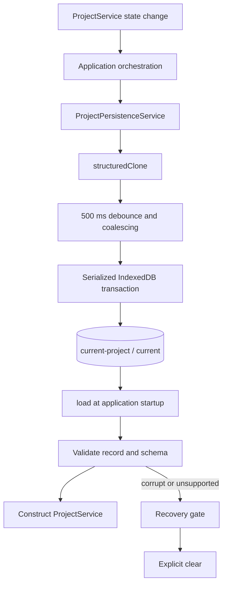

# AgentDAW Project Persistence Design

# 1) Goals

## 1.1 Outcomes

1. Restore the latest successfully saved local project after a reload, window close, or browser restart.
2. Persist only the current `Project` snapshot in browser IndexedDB; history remains session-local.
3. Debounce rapid changes and serialize writes so an older transaction cannot overwrite newer state.
4. Validate the stored record envelope and project schema before loading it.
5. Preserve corrupt or unsupported stored data until the user explicitly clears it.
6. Keep persistence independent of React, audio, WebMCP, and the project command service.
7. Expose explicit load, save, flush, and clear results with actionable failures.

## 1.2 Non-goals

- Multiple projects, project listing, or project selection.
- Persisted undo, redo, restore history, or successful-command deduplication.
- Cloud sync, accounts, cross-device storage, or a backend.
- Multi-tab coordination, locking, or conflict resolution.
- Automatic corruption repair or schema migration.
- Downloadable project import or export.
- Browser automation infrastructure.
- Storage analytics, remote logging, or operational infrastructure.

## 1.3 Assumptions and constraints

- The production target is a current desktop browser with IndexedDB and `structuredClone`.
- One `ProjectPersistenceService` instance exists per application tab.
- All project mutations remain serialized through the existing `ProjectService`.
- The project domain treats typed `Project` values as trusted; persistence validates only the untrusted storage envelope and schema version.
- This design narrows the earlier `docs/design.md` persistence scope: cross-reload history persistence is deferred.
- Project caps in `src/project/model.ts` bound snapshot size.
- The application awaits `clear` before enabling edits to a replacement blank or demo project.
- Multi-tab editing is unsupported and therefore last-writer-wins.
- Autosave durability begins when an IndexedDB transaction completes, not when a save is scheduled.

# 2) Glossary

| Term | Meaning |
|---|---|
| Current project | The single project open in AgentDAW and the only project persisted by this milestone. |
| Pending snapshot | The newest cloned project waiting for the debounce timer or an active write to finish. |
| In-flight write | The one IndexedDB write transaction currently executing. |
| Recovery gate | Service state that blocks writes after corrupt or unsupported data is loaded. |
| Coalescing | Replacing multiple not-yet-written snapshots with only the newest snapshot. |
| Flush | Bypass the debounce delay and wait until the newest pending snapshot is durable. |
| Durable | Successfully committed by an IndexedDB transaction. |

# 3) Technical stack

## 3.1 Language and runtime

- Strict TypeScript using ECMAScript modules.
- Browser-native IndexedDB and `structuredClone` in production.
- Node.js built-in test runner for automated tests.
- No runtime dependency.

## 3.2 Dependencies

| Package or API | Scope | Purpose |
|---|---|---|
| IndexedDB | Browser native | Atomic local storage for the current project. |
| `structuredClone` | Browser native | Detach queued snapshots from caller-owned data. |
| `fake-indexeddb` | Development only | Run the real IndexedDB service under Node tests. |
| `node:test` | Node native | Test runner and timer control. |

## 3.3 Project structure

```text
src/
  project/                  # Existing domain model, commands, and history
  persistence/
    service.ts              # API, IndexedDB access, debounce, ordering, and recovery
test/
  project.test.ts           # Existing domain tests
  persistence.test.ts       # Persistence integration tests using fake-indexeddb
```

Types and persistence errors remain in `service.ts`; separate abstractions are not justified for one implementation.

# 4) Architecture overview



## 4.1 Startup load

Application startup creates the persistence service and calls `load` before constructing `ProjectService`. The service reads the fixed current-project record without modifying it and validates the record shape and project schema. A missing record reports an empty result so the application can choose its normal blank or demo startup behavior.

## 4.2 Autosave scheduling

Application orchestration schedules a save after every current-project change, including successful dispatch, undo, redo, restore, and whole-project replacement. The service clones the snapshot before it can replace pending work. A 500 ms debounce coalesces rapid changes into the newest complete snapshot.

## 4.3 Ordered persistence

Only one write transaction runs at a time. A snapshot scheduled during an in-flight transaction becomes the next pending write; because snapshots are complete values rather than patches, the prior transaction cannot invalidate the pending snapshot. Failure of one write does not make later snapshots structurally dependent on it, so a newer pending write still attempts independently.

Loads and writes share a barrier around the fixed record. A pending write cannot become active while any load is unresolved, including when `flush` makes it ready. A load started behind an active write uses IndexedDB's transaction ordering to observe that write's committed result or rollback, while the load barrier keeps successor writes pending until recovery validation finishes. If a load discovers corrupt or unsupported data, those pending saves complete as `recovery_required` before they can overwrite the raw record.

## 4.4 Browser lifecycle

The application, not the persistence service, listens for document lifecycle events. When the document becomes hidden, application orchestration calls `flush`. Browser shutdown cannot guarantee asynchronous work will finish, so an abrupt process exit may lose the pending 500 ms window while preserving the last completed transaction.

## 4.5 Recovery

A corrupt or unsupported stored project moves the service into recovery-required state. The service refuses `scheduleSave` and `flush` until `clear` succeeds, preventing a newly opened blank project from silently replacing recoverable data. Load never repairs, migrates, deletes, or overwrites a failed record.

# 5) External integration: IndexedDB

IndexedDB is an origin-scoped browser database. No account, OAuth flow, key, webhook, server, or network permission is required. Data is available only to the same browser profile and site origin and may be removed by the user through browser site-data controls.

The application composition root supplies the native `IDBFactory`, normally `globalThis.indexedDB`, explicitly to the service. Tests supply the standards-compatible factory from `fake-indexeddb`; no custom persistence interface or handwritten database fake is introduced.

# 6) `ProjectPersistenceService`

## 6.1 Responsibility

`ProjectPersistenceService` owns the IndexedDB lifecycle for the one current project, along with the debounce timer, newest pending snapshot, active write chain, unresolved-load barrier, and recovery gate. It does not own project mutation, history, UI state, or browser lifecycle listeners.

The service is one concrete class because its operations share lifecycle state. There is no factory, base class, or custom single-implementation interface.

## 6.2 Inputs

- Native `IDBFactory` supplied by the application.
- Clock function used to create deterministic `updatedAt` values.
- Explicit debounce duration; the application uses 500 ms.
- Complete `Project` snapshots after current state changes.

## 6.3 Outputs

- Loaded project or an empty-load result.
- Save result identifying durable completion, cancellation by clear, or failure.
- Clear result identifying successful deletion or failure.
- Typed persistence errors with stable codes and actionable messages.

## 6.4 Error handling and failure modes

| Failure scenario | Behavior | Recovery |
|---|---|---|
| IndexedDB unavailable | Return `storage_unavailable`; keep the in-memory project usable. | Warn the user and retry after browser storage becomes available. |
| Quota exceeded | Return `quota_exceeded`; preserve the previous record and in-memory state. | Free browser storage or explicitly clear, then retry. |
| Malformed record or invalid project schema | Return `corrupt_record`, preserve the record, and enter the recovery gate. | User explicitly clears the record. |
| Unsupported `Project.schemaVersion` | Return `unsupported_schema`, preserve the record, and enter the recovery gate. | Run future compatible code or explicitly clear. |
| IndexedDB transaction abort or unknown storage failure | Return `transaction_failed`; preserve the last completed record. | Retry the latest in-memory project. |
| Save requested while recovery-gated | Return `recovery_required` without opening a write transaction. | Call `clear` successfully first. |
| Clear cancels a pending save | Complete that scheduled save as `cancelled_by_clear`. | Schedule the replacement project only after clear completes. |
| Save requested while clear is active | Complete it as `cancelled_by_clear` without queueing work. | Await clear, then schedule the replacement project. |
| Non-cloneable outbound project | Native `structuredClone` error propagates before pending state changes. | Fix the caller; queued work remains intact. |

Expected browser-storage failures use typed results. Unexpected programming failures are not caught and relabeled as storage errors.

## 6.5 Non-functional requirements

- **Atomicity:** One IndexedDB transaction replaces or deletes the full record.
- **Ordering:** At most one write transaction is active, and no pending write is promoted until all unresolved loads finish; newer pending state writes afterward.
- **Idempotency:** Re-saving the same project safely replaces the same fixed key.
- **Isolation:** Each queued project is a structured clone.
- **Latency:** Normal saves become ready 500 ms after the latest schedule request; `flush` makes them ready immediately, subject to the load/write barrier.
- **Bounded memory:** The service holds at most one in-flight snapshot and one newest pending snapshot.

# 7) Data model

## 7.1 `StoredProjectRecord`

The one record contains the latest durable domain project and its save time.

| Field | Type | Nullable | Notes |
|---|---|---|---|
| `project` | `Project` | no | Complete current project. |
| `updatedAt` | integer | no | Non-negative Unix milliseconds from the supplied clock. |

**Primary key:** Out-of-line fixed key `current`.

**Unique constraints:** The fixed key permits exactly one current record.

**Indexes:** None. The service performs only fixed-key reads, writes, and deletion.

**Notes:**

- `Project.schemaVersion` is the domain-version authority; no duplicate record-version field is stored.
- The IndexedDB database version owns only object-store structure.
- History, cursor position, command outcomes, playback state, selection, decoded audio, and UI state are excluded.

## 7.2 Persistence errors

| Code | Meaning |
|---|---|
| `storage_unavailable` | IndexedDB cannot be opened or used in the current environment. |
| `quota_exceeded` | The browser refused the write due to storage quota. |
| `corrupt_record` | Stored data or its project schema marker is malformed. |
| `unsupported_schema` | Stored project schema is not supported by this application version. |
| `transaction_failed` | An IndexedDB operation aborted or failed for another expected storage reason. |
| `recovery_required` | Writes are blocked to preserve a failed loaded record. |

Errors include an actionable message and retain diagnostic cause information for local logging. User-facing code must not display raw exception details without sanitizing them.

# 8) Storage artifacts

| Setting | Value |
|---|---|
| Database name | `agent-daw` |
| Database version | `1` |
| Object store | `current-project` |
| Record key | `current` |
| Record value | `StoredProjectRecord` |

Database version 1 creates the object store without indexes. Opening an existing version-1 database performs no upgrade write. The service may reuse its connection for the page lifetime, closes it on a database version-change event so future upgrades are not blocked, and discards the cached connection on an unexpected `close` event so a later operation reopens it.

# 9) Core workflows

## 9.1 Load current project

### Purpose

Restore the latest durable local project without mutating stored data.

### Inputs

- IndexedDB factory.

### Procedure

1. Enter the unresolved-load barrier before any asynchronous database work.
2. Open database version 1 and ensure the version-1 store exists.
3. Read key `current` in a read-only transaction; IndexedDB queues it behind an already-active write on the same store.
4. Return `empty` when no record exists.
5. Validate the record container and `updatedAt`.
6. Distinguish an unsupported project schema from other malformed data.
7. Return the loaded project and update time.
8. On corrupt or unsupported data, retain the original record and activate the recovery gate.
9. Leave the load barrier; only the final completing load may promote pending work.

### Error handling

| Failure | Behavior | Recovery |
|---|---|---|
| Database unavailable | Return `storage_unavailable`. | Continue in memory with a warning. |
| Missing record | Return `empty`; this is not an error. | Create the normal blank or demo project. |
| Invalid record | Return `corrupt_record` and block writes. | Explicit clear. |
| Unknown project schema | Return `unsupported_schema` and block writes. | Compatible code or explicit clear. |

### Idempotency

Repeated loads return the same stored value and never write, repair, or delete data.

## 9.2 Schedule autosave

### Purpose

Coalesce rapid current-project changes while providing a durability result to callers.

### Inputs

- Complete current `Project` snapshot.

### Procedure

1. Reject immediately when the recovery gate is active.
2. Clone the project with `structuredClone`.
3. Replace the not-yet-written pending snapshot with the clone.
4. Reuse one shared completion promise for callers covered by that pending flush.
5. Restart the 500 ms debounce timer.
6. When the timer fires, wait for unresolved loads and any active transaction, then atomically store the newest pending snapshot.
7. If a newer snapshot arrived while writing, repeat the write loop once the active transaction completes.
8. Complete each shared save result only when its snapshot or a newer coalesced snapshot is durable.

### Configurable parameters

| Parameter | Default | Description |
|---|---|---|
| Autosave debounce | 500 ms | Balances write frequency against the amount of work exposed to an abrupt process exit. |

### Error handling

| Failure | Behavior | Recovery |
|---|---|---|
| Cloning fails | Keep the previous pending snapshot unchanged. | Fix the caller. |
| Write fails | Return the mapped failure and retain the in-memory project. | A newer queued save still attempts independently. |
| Clear begins before write | Cancel pending work as `cancelled_by_clear`. | Await clear before scheduling replacement state. |

### Idempotency

Each save replaces the fixed key. Duplicate snapshots produce the same stored project with a newer `updatedAt`.

## 9.3 Flush

### Purpose

Request immediate durability for the newest pending project, normally when the document becomes hidden.

### Procedure

1. Reject when the recovery gate is active.
2. Cancel the active debounce timer.
3. If a snapshot is pending, mark it ready immediately and run it after the load barrier permits.
4. If a write is already active, wait for it and any newer pending snapshot.
5. If no work exists, return a successful no-op result.

### Idempotency

Repeated flushes with no new scheduled snapshot perform no database write.

## 9.4 Clear stored project

### Purpose

Explicitly remove the current record, including data that cannot be parsed or validated.

### Procedure

1. Enter an exclusive clear barrier.
2. Cancel the debounce timer and pending snapshot.
3. Complete affected scheduled-save callers as `cancelled_by_clear`.
4. Wait for the active write transaction to finish.
5. Delete key `current` in one read-write transaction without reading its value.
6. Remove the recovery gate only after deletion commits.
7. Return `cleared`.

### Error handling

If deletion fails, the recovery gate remains active when it was already active. The application reports the error and does not enable editing of a replacement project.

### Idempotency

Clearing an absent record succeeds. Repeated clear calls leave storage empty.

# 10) Public contracts

## 10.1 Construction

The application constructs one service with an explicit IndexedDB factory, clock, and debounce duration. Required dependencies avoid hidden globals and keep tests deterministic.

## 10.2 `load`

| Status | Data | Meaning |
|---|---|---|
| `loaded` | Project and `updatedAt` | A valid stored project is ready. |
| `empty` | None | No current record exists. |
| `failed` | Persistence error | Load failed; corrupt and unsupported failures activate recovery. |

## 10.3 `scheduleSave`

Returns a promise for the shared pending durability result. Coalesced callers complete when the newest covered snapshot becomes durable, fails, or is cancelled by clear.

| Status | Data | Meaning |
|---|---|---|
| `saved` | `updatedAt` | The requested state or a newer state is durable. |
| `cancelled_by_clear` | None | Explicit clear discarded the pending write. |
| `failed` | Persistence error | No durability guarantee was achieved for that pending result. |

## 10.4 `flush`

Returns the latest pending or active save result. When no work exists, it returns a successful no-op without creating a transaction.

## 10.5 `clear`

| Status | Meaning |
|---|---|
| `cleared` | The current record is absent and recovery is reset. |
| `failed` | Deletion did not commit; the error explains the recovery action. |

# 11) Security and privacy

- Treat every IndexedDB value as untrusted even though it is origin-scoped.
- Validate container shape, schema version, identifiers, numeric ranges, relationships, and caps before constructing `ProjectService`.
- Store no secrets, executable functions, decoded audio, or HTML.
- Render project names and error messages as text only.
- Keep raw browser exceptions out of user-visible output.
- IndexedDB data remains local unless the user separately exports another artifact.
- Browser same-origin policy isolates the database by scheme, host, and port.

# 12) Operational guardrails

## 12.1 Caps and limits

| Guardrail | Value |
|---|---|
| Current stored projects | 1 |
| In-flight write transactions | 1 |
| Pending snapshots | 1 newest snapshot |
| Autosave debounce | 500 ms |
| Project content | Existing `PROJECT_CAPS` |

## 12.2 Local diagnostics

The application may record the latest persistence error code and sanitized message in local development logs. No remote metrics system is added. Useful manual observations are load duration, save duration, save failure code, and whether lifecycle flush completed.

## 12.3 Health behavior

There is no server health endpoint. A successful startup `load` and a successful autosave transaction are the relevant local health signals. Storage failure never invalidates the in-memory project.

# 13) Data retention and lifecycle

- The latest project remains until `clear`, browser site-data removal, private-session cleanup, or origin change.
- A successful save replaces the prior record; no old project versions are retained.
- Clearing the current project does not affect bundled assets or downloaded WAV files.
- History remains in memory and resets on page reload.
- There is no background cleanup job because storage contains one bounded record.

# 14) Build, deployment, and verification

No infrastructure or deployment resource is required. IndexedDB ships with the browser and follows the existing static deployment.

Implementation proceeds test-first:

1. Add `fake-indexeddb` as the one approved development dependency.
2. Test empty load and save/load round-trip.
3. Test debounce coalescing, write ordering, and flush.
4. Test both `load` → queued save → `flush` and active write → `load` ordering so recovery validation always precedes successor writes.
5. Test clear as an exclusive barrier and `cancelled_by_clear` completion.
6. Insert malformed records directly and test corrupt/unsupported preservation.
7. Test the recovery gate and successful clear reset.
8. Abort real fake-indexeddb read-write transactions after `put` or `delete` and verify rollback preserves the last durable or corrupt record.
9. Force an unexpected database close and verify the next operation opens a fresh connection.
10. Run the complete Node test suite and strict typecheck.
11. Perform one manual browser check: edit, autosave, close or reload, and restore.

Browser automation is deferred until the full application UI exists. A handwritten IndexedDB fake is rejected because `fake-indexeddb` is smaller and exercises the production API surface.

Rollback removes the persistence-service files and development dependency. Stored data remains harmless origin-scoped data and can be removed through browser site-data controls.

# 15) Decision log

## 15.1 Persist only the latest project

**Context:** The MVP needs reload recovery but not a local project library.

**Decision:** Store one complete current `Project` snapshot under a fixed key.

**Alternatives considered:** Persisting history preserves cross-reload undo but multiplies snapshot storage and migration work. Multiple-project storage adds listing and lifecycle semantics not currently required.

**Trade-offs:** Undo and redo reset after reload, and no prior autosave version is recoverable.

## 15.2 Use native IndexedDB

**Context:** The application is browser-only, local-first, and has no backend.

**Decision:** Use browser-native IndexedDB with no runtime persistence dependency.

**Alternatives considered:** `localStorage` is synchronous and string-only. A backend contradicts local-only scope. A wrapper library adds an unnecessary runtime dependency for one record.

**Trade-offs:** IndexedDB is asynchronous and requires event-to-promise handling and a test implementation under Node.

## 15.3 One stateful service class

**Context:** Debouncing, coalescing, write ordering, and recovery share lifecycle state.

**Decision:** Implement one concrete `ProjectPersistenceService` class.

**Alternatives considered:** Stateless functions push ordering into every caller. Separate repository and coordinator abstractions add files and interfaces without another production implementation.

**Trade-offs:** The class owns a small state machine, but its public boundary remains narrow.

## 15.4 Preserve failed records behind a recovery gate

**Context:** Opening a blank project after a corrupt load could otherwise overwrite recoverable user data.

**Decision:** Block writes after corrupt or unsupported load until explicit clear succeeds.

**Alternatives considered:** Automatic replacement loses user data. Automatic repair or migration has no defined target schema.

**Trade-offs:** The user must explicitly discard incompatible data before editing a replacement project.

## 15.5 Debounce and serialize full snapshots

**Context:** Project changes can occur rapidly, while IndexedDB writes are asynchronous.

**Decision:** Coalesce to the newest full snapshot over 500 ms and run at most one transaction at a time.

**Alternatives considered:** Saving every change increases write volume. Persisting patches adds replay and dependency semantics.

**Trade-offs:** An abrupt browser process exit can lose up to the pending debounce window.

## 15.6 Use `fake-indexeddb` for Node tests

**Context:** The repository's Node 23.6 runtime has no built-in IndexedDB.

**Decision:** Add `fake-indexeddb` as a development-only dependency and run the production service against it.

**Alternatives considered:** A handwritten fake is larger and less faithful. Browser automation is premature without the application UI.

**Trade-offs:** One development dependency is added; one manual browser reload check remains necessary.

# 16) Implementation checklist

## Persistence service

- [ ] Define result and error types in `src/persistence/service.ts`.
- [ ] Test and implement database opening and version-1 store creation.
- [ ] Test and implement read-only load with envelope and schema validation.
- [ ] Test and implement debounced save coalescing and structured cloning.
- [ ] Test and implement serialized writes and flush.
- [ ] Test and implement the load/write barrier in both operation orderings.
- [ ] Test and implement recovery gating.
- [ ] Test and implement clear barrier semantics.
- [ ] Import the service directly from `src/persistence/service.ts`.

## Verification

- [ ] Add `fake-indexeddb` as a development dependency.
- [ ] Cover all Section 14 scenarios with `node:test`.
- [ ] Verify rollback with real aborted fake-indexeddb transactions and fresh connection opening after unexpected close.
- [ ] Run `pnpm test`.
- [ ] Run `pnpm run typecheck`.
- [ ] Inspect `git diff` for unintended changes.
- [ ] Run the manual browser reload check when an application shell is available.

# 17) Summary

- One service persists one latest project in IndexedDB.
- The existing project model remains authoritative for trusted application state.
- History and command deduplication remain session-local.
- Autosave coalesces changes over 500 ms and serializes transactions.
- Complete snapshots avoid patch dependencies and invalidation between writes.
- Flush provides an explicit lifecycle durability boundary.
- Corrupt and unsupported data is preserved behind a recovery gate.
- Clear works without parsing stored data and resets recovery only after deletion commits.
- IndexedDB failures never corrupt the in-memory project.
- `fake-indexeddb` verifies production storage behavior under the existing Node test runner.
- No runtime dependency, backend, migration framework, or multi-project abstraction is added.
