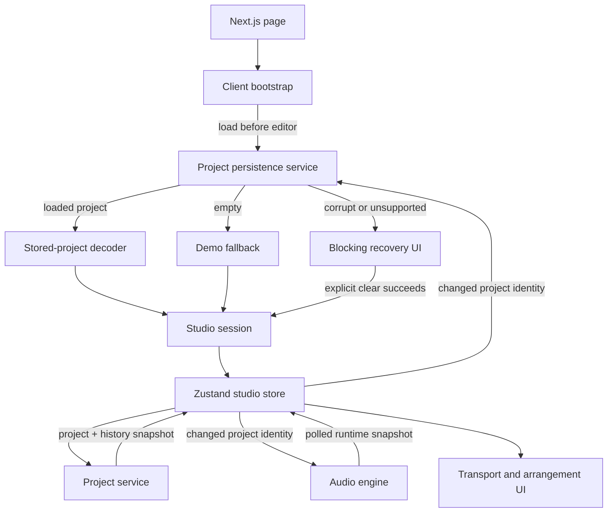

# AgentDAW UI Service Integration Design

Date: 2026-09-02

Status: Draft for review

# 1) Goals

## 1.1 Outcomes

1. Load the latest valid browser-local project before constructing the project service or editable UI session.
2. Play, pause, stop, and seek the current arrangement through the existing Web Audio engine.
3. Keep the arrangement playhead, transport display, and audio engine synchronized from one transport authority.
4. Forward every committed project change to the audio engine immediately and to persistence through the existing debounced save boundary.
5. Preserve editing when audio or ordinary storage operations fail, while preventing corrupt stored data from being overwritten without explicit user consent.
6. Stop playback before undo, redo, or restore installs a history snapshot.
7. Expose accurate local audio and persistence status without mixing those failures into edit-validation errors.
8. Integrate the existing services without a second project model, event bus, generic coordinator framework, or new dependency.

## 1.2 Non-goals

- Loop playback, recording, metronome, count-in, note audition, or scrubbing audio during a drag.
- WAV export or enabling the existing Export control.
- Level metering, spectrum analysis, or a master-output meter.
- Persisting history, undo/redo position, selections, panels, playhead position, audio state, or decoded samples.
- Multiple stored projects, project-file import/export, cloud sync, accounts, or multi-tab coordination.
- Redesigning the workstation or changing existing composition workflows.
- Adding validation to every trusted project command or reducer call.
- Changing audio scheduling, synthesis, sampling, or persistence transaction algorithms except where required to enforce the input boundary.

## 1.3 Assumptions and constraints

- The application runs in a current desktop browser with IndexedDB, Web Audio, `fetch`, `requestAnimationFrame`, and `structuredClone`.
- `Project` schema version 2 remains the authoritative in-memory musical model; schema version 1 remains loadable through the existing migration.
- `ProjectService` remains the sole owner of committed project state and in-session history.
- `AudioEngine` remains the sole owner of transport timing, playback position, Web Audio nodes, and audio diagnostics.
- `ProjectPersistenceService` continues to store one latest complete project under its fixed IndexedDB key.
- Empty storage opens the existing demo project. The demo is not written until the user makes a project change.
- Corrupt or unsupported stored data blocks the editor until the user explicitly clears it.
- History is intentionally session-only and starts empty after reload.
- Existing caps bound all validation, rendering, timeline expansion, and serialization work.
- Existing dependencies and test frameworks are sufficient; no packages are added.

# 2) Glossary

| Term | Meaning |
|---|---|
| **Bootstrap** | The client-only startup phase that loads persistence and chooses the initial project before an editable session exists. |
| **Composition change** | A project change affecting BPM, instruments, patterns, or arrangement and therefore future audio scheduling. |
| **Edit error** | A synchronous validation failure caused by a manual project edit. |
| **History jump** | Undo, redo, or restore replacing the current project with a retained snapshot. |
| **Persistence recovery** | The blocked startup state entered when stored data is corrupt or uses an unsupported schema. |
| **Project snapshot** | One immutable, complete `Project` value published by `ProjectService`. |
| **Runtime projection** | The small subset of audio and persistence state copied into Zustand for React rendering. |
| **Save token** | A monotonically increasing application-owned value identifying the newest scheduled durability request. |
| **Seek preview** | The integer step displayed locally while the user drags the playhead before one engine seek is committed. |
| **Transport authority** | The `AudioEngine` state that determines whether playback is running and the current musical step. |

# 3) Technical Stack

## 3.1 Language and runtime

- Strict TypeScript and ECMAScript modules.
- React 19 and Next.js App Router in the browser.
- Native Web Audio and IndexedDB APIs.
- Node test runner for domain, audio, and persistence tests.
- Vitest, Testing Library, and jsdom for UI integration tests.

## 3.2 Dependencies

| Package or API | Purpose |
|---|---|
| React / Next.js | Client bootstrap, lifecycle effects, and workstation rendering. |
| Zustand | Existing project/UI state bridge plus the runtime projection. |
| Web Audio API | Audio context, scheduling, synthesis, sampling, and mixing. |
| IndexedDB | One browser-local current-project record. |
| `fetch` | Same-origin loading of bundled drum samples. |
| `requestAnimationFrame` | Poll the audio snapshot only while playback is active. |
| `fake-indexeddb` | Existing persistence integration tests. |

No dependency is added.

## 3.3 Project structure

```text
src/
  app/
    page.tsx                         # Renders the client bootstrap with the demo fallback
  components/
    Studio.tsx                      # Bootstrap states and mounted workstation shell
    Transport.tsx                   # Playback controls and status presentation
    arrangement/
      Arrangement.tsx               # Engine-backed playhead plus local seek preview
  audio/
    engine.ts                       # Existing transport and Web Audio authority
    timeline.ts                     # Existing pure timeline expansion
  project/
    service.ts                      # Existing project and history authority
    model.ts                        # Authoritative Project model and caps
  persistence/
    decode.ts                       # Pure decoding of untrusted stored projects
    service.ts                      # Existing IndexedDB lifecycle and save ordering
  stores/
    studio-provider.tsx             # Per-session service ownership and lifecycle
    studio-store.ts                 # UI facade and runtime projection
test/ and src/**/*.test.ts(x)       # Existing test suites and new integration checks
```

`persistence/decode.ts` is the only new subsystem file. Validation is large enough to test independently and does not belong in the trusted project package.

# 4) Architecture Overview

## 4.1 System diagram



## 4.2 Startup stage

The page renders a client bootstrap rather than constructing an editable session immediately. Bootstrap creates one persistence service, calls load, and resolves the startup state before `ProjectService` exists. A loaded project is decoded and used as the session's initial project; empty storage selects the demo project without saving it. Corrupt or unsupported data renders only recovery UI so no replacement project can overwrite the stored record.

## 4.3 Session construction stage

After startup resolves, the studio provider constructs one project service, one Zustand store, and one audio engine for that mounted workstation. The initial project is supplied to both project and audio state before controls become available. The provider owns subscriptions, animation-frame polling, visibility handling, and disposal because those concerns follow the mounted session lifecycle.

## 4.4 Project-change stage

Manual store actions continue to validate intent and dispatch typed commands through `ProjectService`. The store publishes the resulting project and history snapshot exactly as it does today. One subscription compares project identity with the previous snapshot; only a new project value is forwarded to audio and persistence. This captures dispatch, undo, redo, restore, and future trusted adapters without adding a service event bus.

## 4.5 Transport stage

UI controls call the existing audio control surface. Immediate control results update the runtime projection, while a single animation-frame loop polls the engine during playback for continuous position and terminal state changes. The arrangement renders the engine's fractional position during playback and an integer local preview during a drag. On release, one seek is committed and the engine again becomes the visible authority.

## 4.6 Durability stage

Each changed project schedules one debounced full-snapshot save. The runtime projection marks the project as saving and associates the request with a new save token. A completion updates visible durability only when its token is still newest, preventing an earlier active write from reporting a newer pending project as saved. When the document becomes hidden, the provider requests an immediate flush but does not claim browser shutdown can await it.

# 5) External Integrations

## 5.1 IndexedDB

The existing persistence service uses database `agent-daw`, version 1, object store `current-project`, and fixed key `current`. The browser's origin is the security and retention boundary. No permission prompt, account, credential, or network request is involved.

## 5.2 Web Audio and bundled samples

The audio engine receives a browser platform adapter backed by `AudioContext`, native timers, and same-origin `fetch`. Sample URLs remain compile-time catalog values under `/demo/drums/`; project data cannot provide arbitrary URLs. Context creation remains lazy inside audio preparation, so opening or editing the studio does not initialize audio.

## 5.3 Third-party services

There are no third-party integrations, OAuth flows, webhooks, API keys, remote logs, or server resources in this design.

# 6) Components and Services

## 6.1 Client bootstrap

### Responsibility

Own the client-only startup state and prevent editor construction until persistence has selected a safe initial project. It renders loading, blocking recovery, or the mounted studio session.

### Inputs

- Demo project supplied by the page as the empty-storage fallback.
- Browser IndexedDB factory.
- Persistence load and clear results.

### Outputs

- One validated initial project and persistence service for the studio session.
- Loading, memory-only warning, or blocking recovery presentation.

### Error handling and failure modes

| Failure scenario | Behavior | Recovery |
|---|---|---|
| Storage is empty | Mount the demo project with empty session history. | First project change schedules the first save. |
| Valid project loads | Mount that project and show its saved time. | Normal editing continues. |
| Storage is unavailable or a read transaction fails | Mount the demo in memory-only mode with a visible warning. | Later saves retry through the same service; refresh remains risky until one succeeds. |
| Record is corrupt or unsupported | Do not mount the editor; preserve the raw record. | User explicitly clears it, then the demo session mounts. |
| Clear fails | Keep recovery UI and the stored record. | User retries clear after addressing browser storage. |
| Component unmounts while loading | Ignore the late UI result. | A later mount performs its own load. |

### Non-functional requirements

- **Idempotency:** Repeated loads do not mutate storage; repeated clear calls share the service's existing clear operation.
- **Latency:** The loading state remains responsive for the duration of one fixed-key IndexedDB read.
- **Concurrency:** No project service or autosave subscription exists until the load settles.

### Notes

The bootstrap does not hydrate a live project service after the fact. This removes the need for a project replacement API and prevents the demo from racing stored data.

## 6.2 Stored-project decoder

### Responsibility

Convert an unknown IndexedDB value into a canonical trusted `Project` or a specific persistence failure. It validates schema 1 before migration, migrates it through the existing converter, and validates the resulting schema-2 relationships.

### Inputs

- Unknown stored project value.
- Existing project caps.
- Existing runtime sound catalog.

### Outputs

- A newly constructed schema-2 `Project` containing only recognized fields.
- A corrupt-record or unsupported-schema failure for persistence.

### Error handling and failure modes

| Failure scenario | Behavior | Recovery |
|---|---|---|
| Schema marker is not a supported integer | Distinguish malformed from unsupported schema. | Preserve the record and enter recovery. |
| Field type, numeric range, or collection cap is invalid | Reject the complete project. | Explicit clear; no partial project is returned. |
| IDs are empty or duplicated in a required scope | Reject the complete project. | Explicit clear. |
| Clip reference, kind, kit, or overlap relationship is invalid | Reject the complete project. | Explicit clear. |
| Schema-1 migration cannot resolve ownership | Reject the complete project. | Explicit clear. |

### Non-functional requirements

- **Idempotency:** Equal unknown input and catalog produce an equal canonical project.
- **Latency:** Validation is linear over collections bounded by `PROJECT_CAPS`.
- **Concurrency:** The decoder is pure and owns no shared state.

### Notes

Validation covers project names and numeric fields, track and pattern discriminated unions, supported instruments and drum sounds, event bounds, unique IDs, arrangement references, track/pattern compatibility, clip bounds, and same-track overlap. Unknown object fields are discarded when the canonical project is constructed. IDs remain non-empty strings rather than UUID-only because existing demo and migrated data use stable human-readable identifiers.

## 6.3 Studio store and provider

### Responsibility

Remain the UI's single facade over project commands and add only the ephemeral state/actions needed to present audio and persistence. The provider owns concrete service instances and browser lifecycle hooks; the store owns renderable state and user-intent actions.

### Inputs

- Validated initial project.
- Concrete project, audio, and persistence services owned by the mounted session.
- Manual edit and transport intents.
- Audio snapshots and persistence results.

### Outputs

- Project, history, selection, edit error, audio projection, and persistence projection for React.
- Typed calls into the existing services.

### Error handling and failure modes

| Failure scenario | Behavior | Recovery |
|---|---|---|
| Manual edit is invalid | Preserve the project and show the existing edit error. | User corrects the edit. |
| Audio control returns blocked | Preserve editing and show a retry-from-user-gesture message. | User presses Play again. |
| Audio control returns closed | Disable transport controls and request a page reload. | Reload creates a new engine. |
| Audio control rejects unexpectedly | Stop showing a pending state and show an audio error. | User retries or reloads; project remains intact. |
| Save fails | Keep the in-memory project and show unsaved status. | A later project change retries; lifecycle flush can retry pending work. |
| Older save completes after a newer request | Ignore it for visible save state. | Newest token determines the final status. |

### Non-functional requirements

- **Idempotency:** Republishing the same project identity triggers no audio replacement or save.
- **Latency:** Project publication and audio replacement are synchronous; persistence is scheduled without blocking the UI.
- **Concurrency:** Browser event serialization plus audio play-intent revision and persistence save tokens resolve asynchronous races without locks.

### Notes

Audio, persistence, and edit errors remain separate so a successful edit does not clear an unrelated service failure. The UI's `preparing` state is derived from a pending Play request, and `degraded` is derived from unavailable sound IDs; neither is added to `AudioEngineStatus`. Zustand stores a projection for rendering, not a second mutable transport implementation.

## 6.4 Project service

### Responsibility

Continue to own committed musical state, attributed history, undo, redo, restore, command deduplication, and immutable project snapshots. It remains intentionally unaware of React, Web Audio, IndexedDB, and browser lifecycle.

### Inputs

- One trusted validated initial project.
- Trusted typed commands and history controls from application adapters.

### Outputs

- Current project and history snapshots.
- Dispatch results and changed-entity summaries.

### Error handling and failure modes

| Failure scenario | Behavior | Recovery |
|---|---|---|
| Undo or redo is unavailable | Return the existing unavailable result without mutation. | UI disables the unavailable action. |
| Duplicate successful command ID | Return the retained outcome without another commit. | Continue from current state. |
| Trusted caller violates an invariant | Let the programming error propagate. | Fix the adapter; do not add repeated reducer validation. |

### Non-functional requirements

- **Idempotency:** Existing command ID deduplication remains authoritative.
- **Latency:** Commands remain synchronous and bounded by project caps.
- **Concurrency:** JavaScript call serialization is sufficient; no locks or event bus are added.

### Notes

No subscription or whole-project replacement method is added. The UI store already knows when it publishes a service snapshot, and bootstrap supplies the correct initial project before construction.

## 6.5 Audio engine

### Responsibility

Continue to own the audio context, transport clock, playback position, scheduling, mixer graph, active sources, and audio diagnostics. It consumes complete project snapshots and never mutates project or history state.

### Inputs

- Validated current project snapshots.
- Play, pause, stop, seek, and dispose controls.
- Native browser platform functions.

### Outputs

- Stereo audio.
- Control results and read-only runtime snapshots.
- Blocked, degraded, closed, and scheduling diagnostics.

### Error handling and failure modes

| Failure scenario | Behavior | Recovery |
|---|---|---|
| Autoplay policy suspends the context | Return blocked and cancel playback. | Retry Play from a user gesture. |
| One sample is unavailable | Prepare in degraded mode and play available sounds. | Show warning; a later preparation retries missing samples. |
| Arrangement is empty | Return nothing-to-play. | Add a clip. |
| Context closes | Enter permanent closed state and release resources. | Reload the page to create a new session engine. |
| Project composition changes during playback | Cancel future sources and restart from the current musical step. | Continue automatically. |
| Mixer-only project fields change | Ramp existing buses without rebuilding the schedule. | Continue automatically. |

### Non-functional requirements

- **Idempotency:** Existing event keys and generations prevent duplicate scheduling.
- **Latency:** Existing 25 ms scheduler ticks and 100 ms look-ahead remain unchanged.
- **Concurrency:** Existing play-intent revision resolves overlapping asynchronous controls.

### Notes

The engine is created with the session but does not create `AudioContext` until preparation. Snapshot polling remains an application concern; no subscription API is added to the engine.

## 6.6 Project persistence service

### Responsibility

Continue to own IndexedDB opening, fixed-key loading, debounced snapshot coalescing, serialized writes, flush, clear, and the recovery gate. It delegates untrusted project decoding to the pure decoder.

### Inputs

- Native IndexedDB factory.
- Complete trusted project snapshots after identity changes.
- Load, flush, and explicit clear lifecycle requests.

### Outputs

- Typed load, save, flush, and clear results.
- One latest durable project with update time.

### Error handling and failure modes

| Failure scenario | Behavior | Recovery |
|---|---|---|
| Storage unavailable or quota exceeded | Return the existing typed failure and preserve in-memory state. | Show unsaved status and retry later. |
| Decoder rejects stored data | Preserve it and activate recovery-required state. | Explicit clear. |
| Write transaction fails | Preserve the last durable record. | A newer save still attempts independently. |
| Clear races pending work | Cancel pending work and wait for any active write before deleting. | Schedule replacement state only after clear succeeds. |
| Browser closes abruptly | Last completed write remains durable; pending debounce work may be lost. | Flush when the document becomes hidden. |

### Non-functional requirements

- **Idempotency:** Full snapshots safely replace the fixed record; clear remains repeatable.
- **Latency:** Keep the existing 500 ms debounce.
- **Concurrency:** Keep one active write and one newest pending snapshot; unresolved loads remain a write barrier.

### Notes

The service persists project state only. It does not gain UI subscriptions, history storage, or a generalized repository interface.

# 7) Data Model

## 7.1 Authoritative `Project`

`Project` is the only durable musical document and the only project shape consumed by audio and UI rendering.

| Field | Type | Nullable | Notes |
|---|---|---|---|
| `schemaVersion` | literal `2` | no | Supported in-memory schema. |
| `id` | non-empty string | no | Stable project identity. |
| `name` | string | no | User-visible project name. |
| `bpm` | finite number | no | Global tempo, 40 through 240. |
| `masterVolumeDb` | finite number | no | Master gain, -60 through 0 dB. |
| `tracks` | track array | no | Maximum 16; IDs unique. |
| `patterns` | pattern array | no | Maximum 128; IDs unique. |
| `arrangement` | clip array | no | Maximum 512; IDs unique. |

**Primary key:** `id` within the single loaded project.

**Unique constraints:** Track, pattern, and arrangement clip IDs are unique within their collections. Event IDs are unique within a pattern.

**Indexes:** None. Bounded arrays and existing linear scans cover all access patterns.

**Notes:**

- Clips reference existing tracks and patterns by stable ID.
- Pattern and destination track kinds must match.
- Drum events must exist in the destination kit.
- Clips cannot overlap another clip on the same track and must end within 256 bars.
- Project snapshots are immutable after publication.

## 7.2 Stored project record

| Field | Type | Nullable | Notes |
|---|---|---|---|
| `project` | schema-1 or schema-2 project object | no | Unknown until decoded at load. |
| `updatedAt` | non-negative integer | no | Unix milliseconds of the completed write. |

**Primary key:** Fixed out-of-line IndexedDB key `current`.

**Unique constraints:** The fixed key allows exactly one current project record.

**Indexes:** None; all operations use the fixed key.

**Notes:** A loaded schema-1 project migrates in memory but is not rewritten until the user changes the project.

## 7.3 Ephemeral runtime projection

| Group | Fields | Persistence |
|---|---|---|
| Audio | engine status, pending-control state, position step, arrangement end step, warning/error | Never persisted. |
| Persistence | status, latest save token, saved time, sanitized error | Never persisted. |
| UI session | selection IDs, editor tab, panel visibility, seek preview | Never persisted. |
| History | retained entries and cursor | Never persisted. |

The audio position may be fractional while playing. Manual seek targets and accessibility bar/beat/step labels use whole steps.

# 8) Storage Artifacts

| Artifact | Location | Contents | Retention |
|---|---|---|---|
| Current project | IndexedDB `agent-daw/current-project`, key `current` | Complete project plus `updatedAt`. | Until explicit clear or browser site-data removal. |
| Drum samples | `/public/demo/drums/*.wav` | Bundled same-origin PCM WAV assets. | Deployment lifetime. |
| Audio buffers | Audio engine memory | Decoded drum samples. | Session engine lifetime. |
| Project history | Project service memory | Up to 100 before/after entries. | Mounted session lifetime. |

# 9) Core Workflows

## 9.1 Startup and recovery

### Purpose

Choose a safe initial project before any mutable application session exists.

### Inputs

- Persistence load result.
- Demo fallback project.

### Procedure

1. Mount the client bootstrap in a loading state.
2. Construct one persistence service and call load.
3. If loaded, decode and migrate the stored project before constructing `ProjectService`.
4. If empty, choose the demo without scheduling a save.
5. If storage access or the read transaction fails, choose the demo and mark persistence memory-only/failed.
6. If the record is corrupt or unsupported, render blocking recovery UI and do not construct the editor.
7. On explicit clear success, choose the demo and mount a fresh session.
8. Construct the project store and audio engine from the selected project.

### Configurable parameters

| Parameter | Default | Description |
|---|---|---|
| Empty-storage fallback | Existing demo project | Preserves current startup behavior. |

### Error handling

| Failure | Behavior | Recovery |
|---|---|---|
| Non-recovery load failure | Continue in memory with warning. | Later saves retry. |
| Recovery-required load failure | Block editor. | Explicit clear only. |

### Idempotency

Load does not write. Re-entering bootstrap repeats the same safe selection against current storage.

## 9.2 Project publication and autosave

### Purpose

Keep audio and durability synchronized with every committed project without blocking edits.

### Inputs

- Previous and current Zustand snapshots.
- Current audio and persistence services.

### Procedure

1. Project service completes dispatch or a history control synchronously.
2. Store publishes the new project/history snapshot.
3. The session subscription compares project object identity.
4. If identity is unchanged, do nothing.
5. Forward the new project to audio immediately.
6. Increment the save token, mark persistence saving, and schedule the project snapshot.
7. When the save settles, update visible status only if its token is still newest.
8. Never roll back the project because audio or persistence failed.

### Configurable parameters

| Parameter | Default | Description |
|---|---|---|
| Autosave debounce | 500 ms | Existing persistence-service setting. |

### Error handling

| Failure | Behavior | Recovery |
|---|---|---|
| Audio replacement reports a runtime issue | Preserve project and expose audio warning. | Engine retries on later control/project input as supported. |
| Scheduled save fails | Mark current project unsaved. | Next project change schedules a new attempt. |

### Idempotency

Unchanged project identity creates no side effects. Persistence coalesces rapid distinct snapshots to the newest complete project.

## 9.3 Play, pause, and stop

### Purpose

Map the existing transport controls to engine behavior with one visible authority.

### Inputs

- Current audio snapshot and project arrangement.
- User Play/Pause or Stop intent.

### Procedure

1. If status is playing, the primary control pauses.
2. Otherwise, Play starts from the current engine position.
3. If current position equals arrangement end, seek to zero before playing.
4. While preparation is pending, show a preparing state; the engine's existing play-intent revision resolves later competing controls.
5. On successful play, start one animation-frame polling loop.
6. Each frame publishes the latest snapshot; stop polling after status leaves playing.
7. Stop cancels playback and resets position to zero.

### Configurable parameters

| Parameter | Default | Description |
|---|---|---|
| Position refresh | One animation frame while playing | Smooth UI without changing engine scheduling cadence. |

### Error handling

| Failure | Behavior | Recovery |
|---|---|---|
| Nothing to play | Keep stopped and show an actionable audio message. | Add an arrangement clip. |
| Blocked | Keep editing enabled. | User presses Play again. |
| Degraded | Play available sounds and show warning. | Retry later or restore missing assets. |
| Closed | Disable controls. | Reload page. |

### Idempotency

Only one animation-frame handle is active. Repeated Stop remains a harmless reset.

## 9.4 Playhead seek

### Purpose

Support accessible whole-step seeking without restarting audio on every pointer movement.

### Inputs

- Engine position and arrangement end step.
- Pointer or keyboard movement.

### Procedure

1. Render engine position when no seek gesture is active.
2. On pointer down, capture an integer seek preview.
3. During movement, clamp the preview from zero through the actual arrangement end; do not call audio.
4. On release, commit one engine seek and clear the preview.
5. On cancellation, discard the preview and return to engine position.
6. Arrow keys commit one whole-step seek per accepted key action.
7. If project changes shorten the arrangement, use the engine's clamped snapshot immediately.

### Configurable parameters

| Parameter | Default | Description |
|---|---|---|
| Seek quantum | One sixteenth-note step | Matches existing grid and accessibility labels. |

### Error handling

| Failure | Behavior | Recovery |
|---|---|---|
| Engine is blocked or closed | Discard preview and show engine result. | Retry Play or reload. |
| Arrangement is empty | Keep the playhead at zero. | Add a clip. |

### Idempotency

Equal committed seek targets produce the same engine position. Pointer movement alone has no engine side effect.

## 9.5 History jumps

### Purpose

Apply undo, redo, and restore without continuing playback across a potentially large project replacement.

### Inputs

- User history intent.
- Current audio and project service state.

### Procedure

1. Check the current history cursor or restore target and return without touching audio when the action is unavailable.
2. Stop audio before invoking the available project history control.
3. Apply undo, redo, or restore through `ProjectService`.
4. Publish the resulting project/history snapshot.
5. Let the project subscription replace the engine project and schedule autosave.
6. Refresh the audio projection at stopped position zero.
7. Require an explicit Play to resume.

### Configurable parameters

None.

### Error handling

| Failure | Behavior | Recovery |
|---|---|---|
| History action is unavailable | Project and audio remain unchanged. | UI disables unavailable controls. |

### Idempotency

Unavailable history controls do not mutate the project. Restore retains the project service's existing command semantics.

## 9.6 Lifecycle flush and disposal

### Purpose

Reduce pending autosave loss and release audio resources when the session ends.

### Inputs

- Document visibility changes.
- Provider unmount.

### Procedure

1. When document visibility becomes hidden, request persistence flush.
2. Process the result using the current save-token rule.
3. Do not block navigation or claim guaranteed completion.
4. On provider unmount, cancel animation-frame polling and unsubscribe from store/document events.
5. Dispose the audio engine and close its context.

### Configurable parameters

None.

### Error handling

| Failure | Behavior | Recovery |
|---|---|---|
| Flush cannot finish before process exit | Last completed transaction remains durable. | User may lose at most pending unsaved changes. |
| Audio disposal rejects | Report locally during development; UI is already unmounted. | Browser releases page resources. |

### Idempotency

Listener cleanup and audio disposal are safe when repeated by development lifecycle checks.

# 10) Internal Contracts

There is no HTTP or public API in this integration. Existing typed service contracts remain authoritative.

| Producer | Consumer | Contract | Timing |
|---|---|---|---|
| Bootstrap | Project service | One decoded initial `Project` | Once, before session construction. |
| Project service | Zustand store | Project/history snapshot | Synchronous after commands and history controls. |
| Zustand subscription | Audio engine | Complete changed project snapshot | Synchronous after publication. |
| Zustand subscription | Persistence service | Complete changed project snapshot | Debounced asynchronous durability. |
| Audio engine | Zustand store | Read-only audio snapshot/control result | Immediate after controls; one frame while playing. |
| Persistence service | Zustand store | Typed load/save/flush/clear result | Asynchronous. |

No component calls IndexedDB or Web Audio directly. No service imports React or Zustand.

# 11) Security Model

- IndexedDB content is untrusted even though it is same-origin; full decoding occurs before project-service construction.
- The decoder constructs recognized fields rather than passing arbitrary stored objects into the application.
- React renders project names, IDs, and error messages as text rather than HTML.
- Drum sample URLs come only from the compile-time catalog; stored projects cannot trigger arbitrary fetches.
- Raw browser exception details remain in local diagnostics and are not rendered directly.
- No secrets, authentication, authorization, cookies, or server requests exist in this feature.
- Storage remains protected by browser origin isolation and is not encrypted by the application.

# 12) Operational Guardrails

## 12.1 Caps and limits

| Limit | Value |
|---|---:|
| Tracks | 16 |
| Patterns | 128 |
| Events per pattern | 512 |
| Arrangement clips | 512 |
| Arrangement end | 256 bars |
| Operations per batch | 100 |
| History entries | 100 |
| Successful command outcomes | 100 |
| Live synth voices | 64 |
| Autosave debounce | 500 ms |
| Active animation-frame loops | 1 |
| Active persistence writes | 1 |
| Pending persistence snapshots | 1 newest snapshot |

## 12.2 Local signals

- Startup load status and loaded `updatedAt`.
- Current persistence status: saved, saving, memory-only, or failed.
- Audio presentation status: engine status plus derived preparing and degraded indicators.
- Audio unavailable sound IDs and last runtime issue.
- Existing scheduler late-wakeup count for local diagnosis.

## 12.3 Health and alerting

There is no server health endpoint or remote alerting system. A successful startup load/empty result, a successful autosave, and successful first playback are the local health signals. Persistent failures remain visible in the workstation; they do not disable unrelated editing except the deliberate corrupt-data recovery gate.

# 13) Data Retention and Lifecycle

- The latest saved project remains until explicit clear, origin change, private-session cleanup, or browser site-data removal.
- A successful save replaces the previous project; no durable versions or history are retained.
- Undo/redo history, selection, panels, errors, save tokens, and transport position disappear on reload.
- Decoded audio buffers and Web Audio nodes live only for the mounted engine session.
- A schema-1 record remains unchanged on read and becomes schema 2 on the first later project save.
- Multi-tab last-writer behavior remains unsupported and is not detected.
- No cleanup job is required because storage contains one bounded record.

# 14) Deployment and Infrastructure

## 14.1 Infrastructure

No infrastructure-as-code resources are required. The application remains a static-compatible Next.js deployment using browser-local storage and audio.

## 14.2 Build and release checks

1. Run the project/audio/persistence Node tests.
2. Run the UI test suite.
3. Run both strict TypeScript configurations.
4. Run ESLint and the production build.
5. Manually verify first Play in a real browser, including autoplay behavior and audible output.
6. Edit, wait for saved status, reload, and verify the project restores with empty history.
7. Insert an invalid record in local development and verify blocking recovery and explicit clear.
8. Hide the document with a pending change and verify flush is requested.

## 14.3 Migration and rollback

The IndexedDB database and stored record shape do not change. Rollback is an application-code revert; the prior application can continue reading schema-2 project records written by this integration. Because history and runtime state are not added to storage, rollback requires no data migration or cleanup.

# 15) Decision Log

## 15.1 Load before constructing the project service

**Context:** IndexedDB is asynchronous, while the current UI eagerly constructs a project service from a synchronous prop.

**Decision:** Add a client bootstrap gate and construct the editor only after load resolves.

**Alternatives considered:**

- Hydrate an already-live service — requires replacement/reset semantics and can overwrite stored data.
- Server-load IndexedDB — impossible because IndexedDB is browser-local.

**Trade-offs:** The editor has a brief loading state and component tests must distinguish bootstrap from mounted-session behavior.

## 15.2 Validate only at the persistence trust boundary

**Context:** Project reducers intentionally trust typed callers, but IndexedDB returns unknown data.

**Decision:** Add one pure stored-project decoder under persistence and keep the project package trusted.

**Alternatives considered:**

- Add validation throughout reducers — duplicates UI validation and expands every command path.
- Continue shallow casting — allows malformed data to crash UI or audio and risks overwriting recoverable data.

**Trade-offs:** The decoder must evolve with project schema versions and catalog constraints.

## 15.3 Use the audio engine as transport authority

**Context:** The arrangement currently owns a local integer playhead while audio owns continuous playback position.

**Decision:** Render engine position except for a temporary local seek preview, and commit one seek on release.

**Alternatives considered:**

- Keep two synchronized playheads — creates drift and ambiguous end behavior.
- Add transport state to the project — incorrectly persists runtime state and pollutes history.

**Trade-offs:** Seeking is limited to actual arrangement content; empty buffer bars remain editing space, not transport range.

## 15.4 Reuse Zustand publication instead of adding service events

**Context:** All current project mutations already publish through one store bridge.

**Decision:** Subscribe once to changed project identity at the mounted session boundary.

**Alternatives considered:**

- Add subscriptions to `ProjectService` — duplicates an existing publication seam.
- Call audio and persistence from every edit action — misses future mutation paths and repeats side effects.

**Trade-offs:** Any future external adapter must dispatch through the store bridge or explicitly publish through the same path.

## 15.5 Stop playback for history jumps

**Context:** Live edits are safe to reschedule, but undo, redo, and restore can replace large portions of a song.

**Decision:** Stop before every enabled history jump and require explicit replay.

**Alternatives considered:**

- Treat history jumps as live edits — fewer action-specific steps but can produce surprising playback across radically different snapshots.

**Trade-offs:** Small undo operations interrupt playback.

## 15.6 Keep durable history out of scope

**Context:** The persistence service stores only the latest project, while the UI presents session history.

**Decision:** Reload restores the project with empty history.

**Alternatives considered:**

- Persist history snapshots — increases storage, migration, recovery, and save-status complexity.

**Trade-offs:** Undo and Activity entries do not survive reload.

## 15.7 Keep unsupported controls disabled

**Context:** The UI shows loop, record, export, and meters, but the existing services do not implement them.

**Decision:** Wire only play/pause, stop, seek, live mixer changes, status, and autosave.

**Alternatives considered:**

- Infer behavior or build placeholder implementations — expands scope and creates misleading controls.

**Trade-offs:** Some visible workstation controls remain intentionally inactive.

# 16) Implementation Checklist

## Stored-project boundary

- [ ] Write failing tests for invalid schema-2 field types, ranges, caps, IDs, references, compatibility, event bounds, and overlaps.
- [ ] Write failing tests for valid schema-1 decoding followed by migration.
- [ ] Implement the pure stored-project decoder with no new dependency.
- [ ] Route persistence load through the decoder and preserve existing recovery semantics.

## Bootstrap and recovery

- [ ] Write failing UI tests for loading, loaded, empty, memory-only, corrupt, unsupported, clear-success, and clear-failure states.
- [ ] Load persistence before mounting the project service.
- [ ] Preserve the demo fallback without saving it on startup.
- [ ] Block editing until corrupt or unsupported data is explicitly cleared.

## Runtime orchestration

- [ ] Write failing tests proving one project identity change reaches audio and persistence once.
- [ ] Cover dispatch, no-op dispatch, undo, redo, restore, and project changes during playback.
- [ ] Construct one engine per mounted studio and install its initial project.
- [ ] Add one project subscription and clean it up on unmount.
- [ ] Track save completion with newest-token-wins semantics.
- [ ] Keep edit, audio, and persistence failures separate.

## Transport and playhead

- [ ] Write failing UI tests for play/preparing, pause, stop, play-at-end restart, nothing-to-play, blocked, degraded, closed, and unexpected rejection.
- [ ] Write failing tests for animation-frame start, terminal-state detection, and cleanup.
- [ ] Replace the static transport position/status with the audio runtime projection.
- [ ] Replace component-owned playhead authority with engine position plus local drag preview.
- [ ] Commit one seek on pointer release and whole-step seeks from the keyboard.
- [ ] Keep record, loop, export, and level meters disabled/static.

## Persistence lifecycle

- [ ] Write failing tests for saving/saved/failed status races and later retry.
- [ ] Write a failing test that hidden visibility requests flush.
- [ ] Add visibility listener cleanup and non-blocking flush handling.
- [ ] Update the project subtitle to report truthful durability and session-only history.

## Verification

- [ ] Run focused tests after each slice.
- [ ] Run `pnpm test`.
- [ ] Run `pnpm run typecheck`.
- [ ] Run `pnpm run lint`.
- [ ] Run `pnpm run build`.
- [ ] Inspect `git diff` for unrelated changes.
- [ ] Perform real-browser audio, autosave/reload, degraded-audio, and recovery checks.

# 17) Summary

- Persistence selects and validates the initial project before the editor exists.
- Empty storage opens the demo; corrupt or unsupported storage requires explicit clear.
- ProjectService remains the only committed project and history authority.
- AudioEngine remains the only transport and playback-position authority.
- Zustand remains the existing UI publication seam and holds only renderable runtime projections.
- One project subscription updates audio immediately and schedules debounced persistence.
- Save tokens prevent stale write completion from producing a false saved state.
- One animation-frame loop polls audio only while playing.
- Playhead drags preview locally and seek once on release.
- Undo, redo, and restore stop playback before replacing the project snapshot.
- Audio and storage failures never roll back valid in-memory edits.
- History, selection, transport, and decoded audio remain session-only.
- Loop, record, export, and meters remain disabled because no existing service supports them.
- No new runtime dependency, event bus, repository abstraction, or generic coordinator is introduced.
